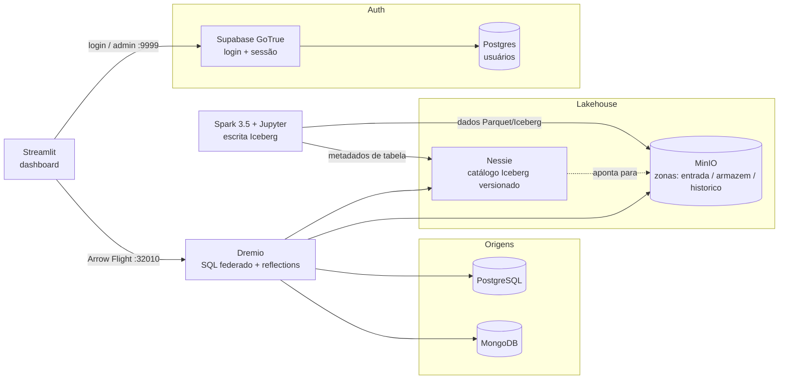

# Data Lakehouse — Dremio + Spark + MinIO + Nessie + PostgreSQL + MongoDB

Stack local de Data Lakehouse, pronta para ser implantada em qualquer projeto: armazenamento em
object store (MinIO), processamento distribuído (Spark), catálogo Iceberg com versionamento tipo git
(Nessie), query engine federada (Dremio) e bancos de origem (PostgreSQL e MongoDB).

Toda a identidade da implantação — nome do projeto, prefixo de containers e volumes, nomes das zonas
de armazenamento e credenciais — vem do arquivo `.env`. O `docker-compose.yml` é genérico e não
precisa ser editado para atender um novo cliente.

- Artigo de referência: <https://www.dremio.com/blog/unifying-data-sources-with-dremio-power-a-streamlit-app/>
- Projeto de referência: <https://github.com/AlexMercedCoder/dremio-notebook>

---

## Índice

1. [Arquitetura](#arquitetura)
2. [Requisitos](#requisitos)
3. [Implantar em um novo projeto](#implantar-em-um-novo-projeto)
4. [Passo a passo](#passo-a-passo)
5. [Autenticação do dashboard](#autenticação-do-dashboard)
6. [Notebooks-modelo](#notebooks-modelo)
7. [Imagem do Spark/Jupyter](#imagem-do-sparkjupyter)
8. [Zonas do object store](#zonas-do-object-store)
9. [Portas e endereços](#portas-e-endereços)
10. [Matriz de versões](#matriz-de-versões)
11. [Armadilhas conhecidas](#armadilhas-conhecidas)
12. [Decisões do compose](#decisões-do-compose)
13. [Solução de problemas](#solução-de-problemas)
14. [Segurança](#segurança)
15. [Estrutura do repositório](#estrutura-do-repositório)

---

## Arquitetura



Os serviços ficam numa rede Docker chamada `interna` (que o Compose publica como
`${PROJETO}_interna`). **Dentro** dessa rede eles se enxergam pelo nome do serviço —
`minio:9000`, `nessie:19120`, `dremio:9047`. **Do navegador ou do host**, use
`localhost:<porta publicada>`. Confundir os dois é a causa mais comum de erro de conexão aqui: um
endpoint com `localhost` dentro de uma configuração do Dremio nunca vai funcionar.

---

## Requisitos

| Item | Mínimo | Observação |
|---|---|---|
| Docker Engine | 24+ | validado com 29.6.1 |
| Docker Compose | v2+ | validado com v5.3.0 |
| RAM livre | **8 GB** (12 GB confortável) | o Dremio sozinho quer ~4 GB; Spark + Jupyter mais 2–3 GB |
| Disco livre | ~15 GB | as imagens somam ~8 GB |
| CPU | x86_64 com AVX | obrigatório para MongoDB 5.0+ |
| Kernel Linux | qualquer | **se ≥ 6.19, fique em `mongo:7.0`** — ver [MongoDB](#mongodb-teto-e-piso) |
| Internet | sim | imagens e, no primeiro run do Spark, os JARs do Iceberg/Nessie |

```bash
docker --version && docker compose version
free -h                          # precisa de RAM DISPONÍVEL, não total
df -h .
grep -o -m1 avx2 /proc/cpuinfo   # deve imprimir "avx2"
uname -r                         # 6.19 ou maior: MongoDB 8.x não sobe
```

Com menos de 8 GB disponíveis o Dremio morre por OOM sem mensagem clara e o container entra em loop
de restart. O compose já limita o heap dele a 2 GB para caber em máquinas apertadas.

---

## Implantar em um novo projeto

Esta stack é whitelabel. Para uma nova implantação:

**1. Escolha o identificador do projeto e confirme que está livre.**

Isto não é formalidade. `docker volume create` num volume que já existe **retorna sucesso** e
devolve o volume existente — não há erro. Se `PROJETO` colidir com outra stack no mesmo host, você
grava dentro dos dados dela. Confira os quatro namespaces:

```bash
NOME=plataforma
docker ps -a      --format '{{.Label "com.docker.compose.project"}}' | sort -u | grep -x "$NOME"
docker volume ls  --format '{{.Name}}'  | grep "^${NOME}_"
docker ps -a      --format '{{.Names}}' | grep "^${NOME}_"
docker network ls --format '{{.Name}}'  | grep "^${NOME}_"
```

Os quatro precisam voltar vazios.

**2. Escreva o `.env`.**

```ini
# identidade: nome do projeto Compose, prefixo dos containers e dos volumes
PROJETO=plataforma

# zonas do object store (buckets do MinIO)
ZONA_ENTRADA=entrada
ZONA_ARMAZEM=armazem
ZONA_HISTORICO=historico

MINIO_ROOT_USER=minio_admin
MINIO_ROOT_PASSWORD=troque-esta-senha
POSTGRES_USER=postgres_admin
POSTGRES_PASSWORD=troque-esta-senha
POSTGRES_DB=nome_do_banco
MONGO_INITDB_ROOT_USERNAME=mongo_admin
MONGO_INITDB_ROOT_PASSWORD=troque-esta-senha
```

Senhas do MinIO precisam de **no mínimo 8 caracteres**. Evite `$`, `&`, `)` e `!`: exigem escape em
YAML e em shell, e são a origem da maioria dos "senha incorreta" aqui.

**3. Troque os dados de exemplo.** Os seeds em `seed/` são de demonstração — substitua pelos do
projeto. Lembre que `docker-entrypoint-initdb.d` só roda com o volume de dados vazio.

**4. Suba.** Siga o [passo a passo](#passo-a-passo) a partir do passo 2.

Nada disso exige editar o `docker-compose.yml`.

### Trocar os nomes das zonas

Basta editar `ZONA_*` no `.env` — mas **só antes da primeira carga**. Os caminhos gravados nos
metadados Iceberg são absolutos (`s3a://armazem/...`), então renomear um bucket que já tem tabelas
quebra as tabelas. Se precisar migrar depois, recrie as tabelas na zona nova em vez de renomear o
bucket, e ajuste o `AWS root path` da fonte Nessie no Dremio.

---

## Passo a passo

### Passo 1 — Preparar diretórios e segredos

```bash
cd dremio-spark-minio

# os diretórios de seed precisam existir antes do up
mkdir -p seed/minio-data seed/postgres seed/mongo seed/notebook-seed
```

Crie o `.env` conforme [Implantar em um novo projeto](#implantar-em-um-novo-projeto). O Compose lê
esse arquivo automaticamente. Ele **nunca** deve ser versionado:

```bash
printf '.env\nstreamlit_test_jupyter/vars.env\ndocker-compose.yml.save\n' >> .gitignore
```

### Passo 2 — Subir a stack

```bash
docker compose config -q && echo "sintaxe OK"   # valida antes de subir
docker compose build spark                      # imagem própria; primeira vez leva minutos
docker compose up -d
docker compose ps
```

Em máquina apertada, suba em duas etapas:

```bash
docker compose up -d minio nessie postgres mongo
docker compose up -d dremio spark
```

### Passo 3 — Validar que tudo respondeu

```bash
curl -sf http://localhost:9000/minio/health/live  && echo "MinIO   OK"
curl -sf http://localhost:19120/api/v2/config     && echo "Nessie  OK"
curl -sf -o /dev/null http://localhost:9047       && echo "Dremio  OK"
curl -sf -o /dev/null http://localhost:8080       && echo "Spark   OK"
curl -sf http://localhost:9999/health             && echo "GoTrue  OK"
```

O Dremio leva **1 a 3 minutos** no primeiro boot. Acompanhe com `docker compose logs -f dremio`.

A resposta do Nessie precisa conter `"maxSupportedApiVersion" : 2` — o Dremio só conecta em servidor
Nessie com API v2 (versão ≥ 0.59.0).

### Passo 4 — MinIO: zonas e credencial de aplicação

Console web: <http://localhost:9001>, com as credenciais do `.env`.

As três zonas são criadas pelo entrypoint no primeiro boot. Para conferir ou recriar à mão:

```bash
docker compose exec minio sh -c '
  mc alias set local http://localhost:9000 "$MINIO_ROOT_USER" "$MINIO_ROOT_PASSWORD" &&
  mc mb -p local/$ZONA_ENTRADA local/$ZONA_ARMAZEM local/$ZONA_HISTORICO &&
  mc cp --recursive /seed-entrada/ local/$ZONA_ENTRADA/ &&
  mc ls local'
```

Deve listar `armazem/`, `entrada/` e `historico/`. O papel de cada uma está em
[Zonas do object store](#zonas-do-object-store).

Crie uma **access key dedicada** para Spark e Dremio — não use a credencial root:

```bash
docker compose exec minio sh -c '
  mc alias set local http://localhost:9000 "$MINIO_ROOT_USER" "$MINIO_ROOT_PASSWORD" &&
  mc admin user svcacct add local "$MINIO_ROOT_USER"'
```

Guarde o `Access Key` e o `Secret Key` — são usados nos passos 6, 7 e 9.

### Passo 5 — Dremio: criar o usuário administrador

Abra <http://localhost:9047>. No primeiro acesso o Dremio pede para criar o admin. As credenciais vão
para `streamlit_test_jupyter/vars.env` no passo 10.

### Passo 6 — Dremio: MinIO como fonte S3

**Add Source → Amazon S3**

| Campo | Valor |
|---|---|
| Name | `minio` |
| Authentication | AWS access key |
| AWS Access Key / Secret Key | as do passo 4 |
| Encrypt connection | **desmarcado** (o MinIO local é HTTP) |

Em **Advanced Options**, marque `Enable compatibility mode` e adicione as Connection Properties:

| Propriedade | Valor |
|---|---|
| `fs.s3a.path.style.access` | `true` |
| `fs.s3a.endpoint` | `minio:9000` *(sem `http://`)* |
| `dremio.s3.compat` | `true` |

Salve. As zonas aparecem na árvore de datasets. Abra `minio → entrada` e promova `employees.csv` a
dataset para testar.

### Passo 7 — Dremio: Nessie como catálogo Iceberg

**Add Source → Nessie**

| Campo | Valor |
|---|---|
| Name | `nessie` |
| Nessie endpoint URL | `http://nessie:19120/api/v2` |
| Nessie authentication | `None` |
| Storage provider | AWS (S3) |
| AWS root path | `armazem` *(o valor de `ZONA_ARMAZEM`)* |
| AWS Access/Secret Key | as do passo 4 |
| Encrypt connection | **desmarcado** |

Em **Advanced Options**, as mesmas três propriedades do passo 6.

### Passo 8 — Dremio: PostgreSQL e MongoDB

**Add Source → PostgreSQL**

| Campo | Valor |
|---|---|
| Host | `postgres` |
| Port | `5432` *(porta interna, não a 5435 publicada)* |
| Database | valor de `POSTGRES_DB` |
| Username / Password | do `.env` |

**Add Source → MongoDB**

| Campo | Valor |
|---|---|
| Host | `mongo` |
| Port | `27017` |
| Username / Password | do `.env` |
| Authentication database | `admin` |

### Passo 9 — Spark + Jupyter: gravar uma tabela Iceberg

Abra o JupyterLab em <http://localhost:8889> (sem token). Os modelos prontos estão em
`notebooks/` — comece por `00_ambiente.ipynb` e veja [Notebooks-modelo](#notebooks-modelo). O código
abaixo é o mesmo que o `lakehouse.py` encapsula, mostrado por extenso para referência.

```python
from pyspark.sql import SparkSession

MINIO_KEY    = "COLE_A_ACCESS_KEY_DO_PASSO_4"
MINIO_SECRET = "COLE_A_SECRET_KEY_DO_PASSO_4"
S3_ENDPOINT  = "http://minio:9000"
NESSIE_URI   = "http://nessie:19120/api/v2"
WAREHOUSE    = "s3a://armazem/"          # valor de ZONA_ARMAZEM

PACKAGES = ",".join([
    "org.apache.iceberg:iceberg-spark-runtime-3.5_2.12:1.9.2",
    # 0.106.0 e a ULTIMA compilada para Java 11, que e o Java desta imagem do Spark.
    # 0.107+ exige Java 17 e quebra com UnsupportedClassVersionError. Ver nota abaixo.
    "org.projectnessie.nessie-integrations:nessie-spark-extensions-3.5_2.12:0.106.0",
    "org.apache.hadoop:hadoop-aws:3.3.4",
    "software.amazon.awssdk:bundle:2.24.8",
    "software.amazon.awssdk:url-connection-client:2.24.8",
])

spark = (
    SparkSession.builder.appName("iceberg-nessie-minio")
    .config("spark.jars.packages", PACKAGES)
    .config("spark.sql.extensions",
            "org.apache.iceberg.spark.extensions.IcebergSparkSessionExtensions,"
            "org.projectnessie.spark.extensions.NessieSparkSessionExtensions")
    .config("spark.sql.catalog.nessie", "org.apache.iceberg.spark.SparkCatalog")
    .config("spark.sql.catalog.nessie.catalog-impl", "org.apache.iceberg.nessie.NessieCatalog")
    .config("spark.sql.catalog.nessie.uri", NESSIE_URI)
    .config("spark.sql.catalog.nessie.ref", "main")
    .config("spark.sql.catalog.nessie.authentication.type", "NONE")
    .config("spark.sql.catalog.nessie.warehouse", WAREHOUSE)
    .config("spark.sql.catalog.nessie.io-impl", "org.apache.iceberg.aws.s3.S3FileIO")
    .config("spark.sql.catalog.nessie.s3.endpoint", S3_ENDPOINT)
    .config("spark.sql.catalog.nessie.s3.path-style-access", "true")
    .config("spark.hadoop.fs.s3a.endpoint", S3_ENDPOINT)
    .config("spark.hadoop.fs.s3a.path.style.access", "true")
    .config("spark.hadoop.fs.s3a.access.key", MINIO_KEY)
    .config("spark.hadoop.fs.s3a.secret.key", MINIO_SECRET)
    .getOrCreate()
)

# o namespace vira o prefixo dentro do armazém: s3a://armazem/limpeza/
spark.sql("CREATE NAMESPACE IF NOT EXISTS nessie.limpeza")
spark.sql("""
    CREATE TABLE IF NOT EXISTS nessie.limpeza.vendas (id INT, produto STRING, valor DOUBLE)
    USING iceberg TBLPROPERTIES ('format-version'='2')
""")
spark.sql("INSERT INTO nessie.limpeza.vendas VALUES (1,'Notebook',3500.0), (2,'Monitor',1200.0)")
spark.sql("SELECT * FROM nessie.limpeza.vendas ORDER BY id").show()
```

Notas:

- O primeiro `getOrCreate()` baixa os JARs do Maven Central: 1 a 3 minutos, e **exige internet**.
  Depois ficam em cache no `~/.ivy2` do container.
- **A versão das extensões Nessie não é livre.** A imagem `alexmerced/spark35nb` roda **Java 11**, e
  `nessie-spark-extensions` a partir da **0.107** é compilada para Java 17. Usar a 0.108.4 (mesma
  versão do servidor) falha no primeiro `spark.sql()`:

  ```
  java.lang.UnsupportedClassVersionError: org/projectnessie/nessie/cli/grammar/ParseException
  has been compiled by a more recent version of the Java Runtime (class file version 61.0),
  this version of the Java Runtime only recognizes class file versions up to 55.0
  ```

  Use **0.106.0**, a última em bytecode Java 11. O cliente 0.106.0 conversa normalmente com o
  servidor 0.108.4 pela API v2; as versões não precisam coincidir.
- Mantenha `'format-version'='2'`. O Iceberg 1.10+ disponibilizou o formato v3, e o Dremio 26 lê com
  segurança apenas v1/v2. Por isso o exemplo fixa o Iceberg em `1.9.2`; com `1.11.0`, declarar
  `format-version=2` passa a ser obrigatório.
- Depois do `INSERT`, volte ao Dremio: a tabela aparece em `nessie → limpeza → vendas`. É o teste que
  prova que Spark, Nessie, MinIO e Dremio estão realmente integrados.

Branches do Nessie funcionam como no git:

```python
spark.sql("CREATE BRANCH IF NOT EXISTS experimento IN nessie FROM main")
spark.sql("USE REFERENCE experimento IN nessie")
```

### Passo 10 — Streamlit

Copie o template e preencha `streamlit_test_jupyter/vars.env`. Ele tem três blocos: a conta de
serviço do Dremio (do passo 5, usada para **consultar** o lakehouse), a configuração do Supabase
(login) e o cookie de sessão. Detalhes em [Autenticação do dashboard](#autenticação-do-dashboard).

```bash
cp streamlit_test_jupyter/vars.env.example streamlit_test_jupyter/vars.env
# gere os segredos:
python3 -c "import secrets; print(secrets.token_urlsafe(48))"   # COOKIE_SECRET
```

```ini
# Dremio (conta de serviço que consulta o lakehouse)
DREMIO_USERNAME=seu_usuario
DREMIO_PASSWORD=sua_senha
DREMIO_ENDPOINT=dremio:9047
DREMIO_FLIGHT_ENDPOINT=dremio:32010
# Supabase (login) — SUPABASE_URL usa o nome de serviço na rede Docker.
AUTH_ENABLED=true
SUPABASE_URL=http://supabase-auth:9999
JWT_SECRET=<IDÊNTICO ao JWT_SECRET do .env da stack>
AUTH_MASTER_EMAIL=master@seu-dominio.local
AUTH_MASTER_PASSWORD=<senha forte do master>
COOKIE_SECRET=<32+ caracteres>
```

Os endpoints usam nomes de serviço porque o app roda **dentro** da rede Docker. Os serviços de
autenticação (`supabase-db`, `supabase-auth`) já sobem com o `docker compose up -d` do passo 2.
Ajuste a query em `app.py` para um dataset que exista no seu Dremio e rode:

```bash
docker compose exec -w /workspace/streamlit spark \
  streamlit run app.py --server.port 8501 --server.address 0.0.0.0
```

Acesse <http://localhost:8502> e entre com o usuário **master** (criado no primeiro boot a partir do
`vars.env`). Pela barra lateral → **Administrar usuarios**, crie as contas de quem vai visualizar.

> A porta 8501 é a de **dentro** do container; no host ela sai em **8502**. A pasta chega ao
> container pelo volume `./streamlit_test_jupyter:/workspace/streamlit`, e o `streamlit` já vem
> instalado pelo entrypoint.
>
> Para desligar o login em desenvolvimento, use `AUTH_ENABLED=false` no `vars.env`.

### Passo 11 — Parar e limpar

```bash
docker compose stop      # pausa, mantém tudo
docker compose down      # remove containers, MANTÉM os volumes nomeados
docker compose down -v   # apaga TAMBÉM os dados de todos os serviços
```

---

## Autenticação do dashboard

O dashboard fica atrás de um login. A autenticação usa **Supabase GoTrue** (a API de auth do
Supabase) com um Postgres dedicado — dois serviços que já vêm no `docker-compose.yml`
(`supabase-db` e `supabase-auth`). O Streamlit continua consultando o Dremio com a conta de serviço
do `vars.env`; o Supabase só decide **quem** entra no painel. Não subimos o Supabase Studio (a UI
visual) — o gerenciamento de usuários é feito pelo painel do master, dentro do próprio app.

### Modelo de usuários: master + visualizadores

- Cadastro público **desligado** (`SUPABASE_DISABLE_SIGNUP=true`): ninguém se registra sozinho.
- Um **usuário master** (`AUTH_MASTER_EMAIL`) é criado no primeiro boot do app, a partir do
  `vars.env`. Se não existir, é recriado a partir dessas variáveis.
- Só o master cria/remove usuários, pelo painel **"Administrar usuarios"** na barra lateral. Por
  baixo, ele chama a Admin API do GoTrue (`/admin/users`) com um token `service_role` assinado
  localmente com o `JWT_SECRET` (nunca vai ao navegador).
- Os demais usuários apenas visualizam a aplicação.

### Configuração (duas metades, de propósito)

| Onde | Variáveis | Papel |
|---|---|---|
| `.env` da stack | `JWT_SECRET`, `SUPABASE_DB_PASSWORD`, `SUPABASE_DISABLE_SIGNUP`, `SUPABASE_MAILER_AUTOCONFIRM`, `SUPABASE_AUTH_PORT` | Infra do GoTrue (compose) |
| `streamlit_test_jupyter/vars.env` | `SUPABASE_URL`, `AUTH_ENABLED`, `COOKIE_SECRET`, `AUTH_MASTER_EMAIL/PASSWORD`, `JWT_SECRET` | Cliente do app |

O `JWT_SECRET` aparece nos **dois** arquivos e precisa ser **idêntico**: o GoTrue assina os tokens
com ele, e o app o usa para assinar o token de admin do painel do master. Gere os segredos com
`python3 -c "import secrets; print(secrets.token_urlsafe(48))"`.

### Sessão e cookie

Depois do login, a sessão (tokens do GoTrue) é guardada num **cookie criptografado** no navegador —
a chave de cifra fica no servidor (`COOKIE_SECRET`), o componente só enxerga o texto cifrado. O
`access_token` é renovado pelo `refresh_token` perto de expirar; ao sair, o cookie é apagado e a
tela de login volta. `AUTH_ENABLED=false` pula tudo isso (modo dev) e consulta direto com a conta de
serviço.

### Sem servidor de e-mail

`SUPABASE_MAILER_AUTOCONFIRM=true` porque não há SMTP local: as contas criadas pelo master já entram
sem confirmar e-mail. Para produção com e-mail real, configure as variáveis `GOTRUE_SMTP_*` e ponha
o autoconfirm em `false`.

### Módulo `auth/`

`streamlit_test_jupyter/auth/`: `supabase_client.py` (cliente GoTrue + Admin API), `session.py`
(normaliza, renova e valida a sessão), `cookies.py` (cookie criptografado) e `authentication.py`
(`require_auth()`, telas de login e o painel do master).

### Armadilhas

- **`supabase-init.sql` não pode pré-criar `auth.factor_type`.** A migração de MFA do GoTrue cria
  três tipos (`factor_type`, `factor_status`, `aal_level`) num único bloco
  `DO ... EXCEPTION WHEN duplicate_object`; se `factor_type` já existe, o bloco cai no `EXCEPTION` e
  **pula** os outros dois — a tabela seguinte quebra com `type "factor_status" does not exist` e o
  GoTrue fica `unhealthy` num loop. O init só cria o schema `auth`, o `search_path` e o role
  `postgres`. Se cair nisso, corrija o init e **recrie o volume** (o init só roda em volume novo):
  `docker compose rm -sf supabase-auth supabase-db && docker volume rm <PROJETO>_supabase-auth-data`.
- **`streamlit-cookies-manager` 0.2.0 × Streamlit ≥ 1.36.** A lib (sem manutenção) reusa a mesma
  key de componente no `save()`; o Streamlit ≥ 1.36 proíbe key repetida no mesmo run e derruba o app
  (aparecia no logout, com `StreamlitDuplicateElementKey`). O `cookies.py` aplica dois monkeypatches
  (key única por run + troca do `st.cache` legado por `st.cache_resource`). A lib está fixada no
  `docker/spark/requirements.txt`; depois de recriar o container `spark`, rode
  `docker compose build spark`.

---

## Notebooks-modelo

A pasta `notebooks/` traz modelos prontos para conectar fontes externas, tratar os dados e
entregá-los ao Streamlit. Ela é montada no container, então o que você editar no JupyterLab
(<http://localhost:8889>) fica versionado no repositório.

```
    origem externa                 tratamento                    consumo
  ┌────────────────┐          ┌────────────────┐          ┌────────────────┐
  │ 01 PostgreSQL  │          │                │          │                │
  │ 02 MySQL       │ ──────►  │ 10_tratamento  │ ──────►  │  20_publicar   │
  │ 03 CSV         │          │                │          │   → Streamlit  │
  │ 04 JSON        │          │                │          │                │
  └────────────────┘          └────────────────┘          └────────────────┘
       coleta            limpeza → refinamento              Arrow Flight
```

| Notebook | O que faz |
|---|---|
| `00_ambiente.ipynb` | Confere se MinIO, Nessie e Dremio respondem. **Rode primeiro.** |
| `01_origem_postgres.ipynb` | Lê tabela de PostgreSQL externo via JDBC → `coleta` |
| `02_origem_mysql.ipynb` | Idem para MySQL/MariaDB |
| `03_origem_csv.ipynb` | Lê CSV da zona de entrada → `coleta` |
| `04_origem_json.ipynb` | Lê JSON, inclusive aninhado → `coleta` |
| `10_tratamento.ipynb` | `coleta` → `limpeza` → `refinamento` |
| `20_publicar.ipynb` | Confere a ponte Dremio → Arrow Flight → Streamlit |
| `lakehouse.py` | Módulo comum: sessão Spark, leitura, escrita, perfil |

Detalhes de uso em [`notebooks/README.md`](notebooks/README.md).

### As três camadas

| Camada | Pergunta que responde | O que entra |
|---|---|---|
| `coleta` | *o que a origem mandou?* | dado como veio, sem tratamento |
| `limpeza` | *o dado está correto?* | tipos, nulos, duplicatas, validação |
| `refinamento` | *está pronto para uso?* | joins, agregações, regras de negócio |

O Streamlit lê **só do refinamento**. Separar as camadas permite corrigir uma regra de negócio sem
reprocessar a ingestão, e auditar em que ponto um número mudou. Cada camada é um namespace no
Nessie e um prefixo dentro do armazém — `coleta.clientes` fica em
`s3a://armazem/coleta/clientes_<uuid>/`.

### O módulo `lakehouse.py`

Evita repetir a configuração do Spark em cada notebook e lê tudo do ambiente, então nenhuma senha
da stack aparece em código:

```python
from lakehouse import sessao, ler_jdbc, ler_arquivo, gravar, perfil, listar

spark = sessao("meu-notebook")
df = ler_jdbc(spark, tipo="postgres", host="10.0.0.5", banco="vendas",
              tabela="public.pedidos", usuario="app", senha="...")
perfil(df)                       # linhas, tipos, nulos, distintos
gravar(df, "coleta.pedidos")     # tabela Iceberg no catálogo
```

As versões de Iceberg e das extensões Nessie estão fixadas ali com o motivo ao lado — veja
[matriz de versões](#matriz-de-versões) antes de mexer.

### Fontes além das quatro

`ler_jdbc` serve para qualquer banco cujo driver você adicione:

```python
spark = sessao("oracle", pacotes_extra=["com.oracle.database.jdbc:ojdbc11:23.5.0.24.07"])
```

O Dremio, por sua vez, conecta direto em 24 tipos de fonte (Oracle, SQL Server, DB2, Snowflake,
Elasticsearch, entre outras) sem passar pelo Spark — útil quando você só quer consultar, não
materializar. Nesse caso a fonte é criada na UI do Dremio e o Streamlit já a enxerga.

> **A stack não inclui um servidor MySQL.** O notebook 02 e o conector do Dremio funcionam, mas
> apontam para um MySQL externo. Se precisar de um local, adicione ao compose.

---
## Imagem do Spark/Jupyter

O serviço `spark` roda uma imagem própria, construída a partir de
[`docker/spark/Dockerfile`](docker/spark/Dockerfile). As bibliotecas ficam **dentro da imagem**, não
num `pip install` de entrypoint — que atrasaria todo boot e se perderia a cada recriação do
container.

```bash
docker compose build spark          # construir (a primeira vez leva alguns minutos)
docker compose up -d spark
docker compose build --no-cache spark   # reconstruir do zero
```

Para adicionar bibliotecas, edite [`docker/spark/requirements.txt`](docker/spark/requirements.txt) e
reconstrua. Não use `!pip install` na célula do notebook a não ser para teste rápido: some quando o
container é recriado.

### O que vem instalado

| Área | Bibliotecas |
|---|---|
| Dados | pandas, numpy, scipy, pyarrow, polars, duckdb, openpyxl |
| Visualização | matplotlib, seaborn, plotly, altair, folium, missingno |
| Machine learning | scikit-learn, xgboost, lightgbm, catboost, imbalanced-learn |
| Explicabilidade e tuning | shap, optuna |
| Experimentos | mlflow |
| Séries temporais | statsmodels, prophet |
| Deep learning | tensorflow, torch, keras |
| Linguagem natural | nltk, spacy *(sem modelos — ver abaixo)* |
| Geoespacial | geopandas, shapely, pyproj, pyogrio |
| Lakehouse | pyspark (+ MLlib), pyiceberg, boto3, minio |
| App | streamlit, dremio-simple-query, python-dotenv |

Modelos de NLP não vêm no pacote, porque pesam e nem todo projeto usa. Descomente as linhas
correspondentes no Dockerfile e reconstrua:

```dockerfile
RUN python -m spacy download pt_core_news_sm
RUN python -m nltk.downloader -d /usr/share/nltk_data stopwords punkt
```

### Duas travas que não devem sair do requirements

```
protobuf>=4.25,<5
numpy<2
```

A imagem base vem com `protobuf 7.x`, mas o TensorFlow 2.17 exige `<5`. Sem a trava, o TF importa
cuspindo `AttributeError: 'MessageFactory' object has no attribute 'GetPrototype'` — funciona
parcialmente, e falha em pontos difíceis de diagnosticar. A trava do numpy protege TensorFlow 2.17 e
torch 2.4, que não funcionam com numpy 2.x.

O Dockerfile termina com uma verificação de import: se uma instalação nova quebrar numpy, TF, torch
ou pyspark, **a construção falha ali** em vez de o problema aparecer semanas depois num notebook.

### Tamanho

A imagem base já tem ~17 GB (torch e tensorflow compilados com CUDA); esta camada leva o total a
~18 GB. Se espaço for problema, corte do `requirements.txt` o que não usar — ou troque torch e
tensorflow pelas variantes CPU, que economizam vários GB:

```
torch --index-url https://download.pytorch.org/whl/cpu
```

> **Sem GPU.** Apesar do build CUDA, não há passagem de GPU configurada no compose. torch e
> tensorflow rodam em CPU.

### Spark MLlib x scikit-learn

Os dois estão disponíveis e resolvem problemas diferentes: `scikit-learn` treina em memória num nó
só; `pyspark.ml` distribui pelo cluster. Para o volume que esta stack local comporta, scikit-learn
quase sempre basta e é mais simples.

O caminho natural no notebook é usar o Spark para ler e agregar o volume grande, e `.toPandas()` no
resultado já reduzido para entregar ao scikit-learn ou ao matplotlib. Cuidado: `.toPandas()` traz
tudo para a memória do driver, limitada a 1 GB em `lakehouse.py` — passe o tamanho desejado em
`sessao(memoria="4g")` se precisar de mais.

---
## Zonas do object store

O MinIO é organizado em **três buckets**, chamados aqui de zonas. Os nomes vêm do `.env`, então o
padrão se adapta a qualquer projeto sem tocar no compose.

| Zona | Bucket | O que guarda | Quem escreve | Formato |
|---|---|---|---|---|
| Entrada | `entrada` | Arquivos como chegam da origem, sem catálogo | ingestão, cargas manuais | CSV, JSON, Parquet solto |
| Armazém | `armazem` | Tabelas gerenciadas pelo catálogo Iceberg/Nessie | Spark e Dremio | Iceberg (Parquet + metadados) |
| Histórico | `historico` | Cargas antigas, backups, material de descarte | rotinas de arquivamento | qualquer |

```
entrada/                      aterrissagem — nada aqui é confiável ainda
├── employees.csv
├── departments.csv
└── salaries.csv

armazem/                      warehouse ÚNICO do catálogo Nessie
├── coleta/                   ← namespace (camada), não bucket
│   └── funcionarios_<uuid>/
│       ├── 0_0_0.parquet           os dados
│       └── metadata/               o que faz ser tabela Iceberg
│           ├── *.metadata.json     schema + lista de snapshots
│           └── *.avro              manifests: quais arquivos valem em cada versão
└── limpeza/
    └── vendas_<uuid>/

historico/                    vazio até você criar uma rotina de arquivamento
```

O `metadata/` é o que separa uma tabela Iceberg de um monte de Parquet solto: o `.metadata.json`
guarda schema e a lista de snapshots, e os `.avro` são os manifests que dizem quais arquivos de dados
pertencem a cada versão. É daí que vêm o time travel e a leitura consistente. O Nessie não guarda
dado nenhum — ele aponta, por branch, para qual `metadata.json` é o atual. O sufixo UUID no nome da
pasta existe para que branches diferentes não colidam.

### Por que três zonas, e não uma por camada

A tentação é criar um bucket por camada da arquitetura medalhão (`coleta`, `limpeza`,
`refinamento`). **Não funciona com o Nessie:** o catálogo aponta para **um único warehouse**. Toda
tabela Iceberg, de qualquer camada, cai dentro de `armazem` de qualquer jeito — buckets por camada
ficariam vazios.

A separação por camada existe, mas em outro nível:

| Nível | Onde fica | Exemplo |
|---|---|---|
| Físico | prefixo dentro de `armazem` | `armazem/coleta/`, `armazem/limpeza/` |
| Catálogo | namespace no Nessie | `nessie.coleta`, `nessie.limpeza` |
| Lógico | space no Dremio | `coleta`, `limpeza`, `refinamento` |

Criar o namespace gera o prefixo automaticamente. Os três níveis ficam alinhados sem configuração
extra:

```sql
CREATE FOLDER nessie.coleta;
CREATE TABLE nessie.coleta.funcionarios (id INT, nome VARCHAR, salario DOUBLE);
-- grava em s3a://armazem/coleta/funcionarios_<uuid>/
```

---

## Portas e endereços

| Serviço | Porta host | Uso |
|---|---|---|
| Dremio | 9047 | UI e API REST |
| Dremio | 31010 | ODBC/JDBC legado |
| Dremio | 32010 | **Arrow Flight SQL** (usado pelo Streamlit) |
| Dremio | 45678 | comunicação interna do cluster |
| Spark Master | 8080 | Web UI |
| Spark Master | 7077 | submissão de jobs |
| Spark Worker | 8081 | Web UI |
| Spark Jobs | 4040–4045 | UI por aplicação em execução |
| Spark History | 18080 | histórico de jobs |
| JupyterLab | **8889** | notebooks (sem token) — mapeada da 8888 interna |
| Streamlit | **8502** | dashboard — mapeada da 8501 interna |
| Supabase GoTrue | 9999 | API de autenticação do dashboard |
| MinIO | 9000 | API S3 |
| MinIO | 9001 | console web |
| Nessie | 19120 | API REST (`/api/v2`) |
| PostgreSQL | 5435 | mapeada da 5432 interna |
| MongoDB | 27017 | — |

O Postgres do Supabase (`supabase-db`) **não** publica porta no host: é acessado só de dentro da
rede pelo GoTrue. Para inspecionar usuários, use o painel do master ou
`docker compose exec supabase-db psql -U supabase_auth_admin -d supabase_auth`.

Jupyter e Streamlit são publicados em 8889/8502 porque 8888 e 8501 costumam já estar ocupadas.
Dentro da rede Docker eles continuam em 8888/8501 — o remapeamento é só na publicação.

---

## Matriz de versões

Levantamento de **11/08/2026** nos registries e na documentação de cada projeto. As versões da coluna
"Em uso" são as aplicadas no compose.

| Serviço | Em uso | Mais recente | Por que não a mais recente |
|---|---|---|---|
| Dremio | `dremio/dremio-oss:26.0.5` | 26.0.5 | é a mais recente; a tag está fixada de propósito, `latest` muda sem aviso |
| Spark/Jupyter | imagem própria sobre `alexmerced/spark35nb:latest` | Spark 3.5.2 | base da comunidade + libs de DS/ML — ver [Imagem do Spark/Jupyter](#imagem-do-sparkjupyter) |
| MinIO | `RELEASE.2025-04-22T22-12-26Z` | `RELEASE.2025-09-07T16-13-09Z` | as posteriores removem o console administrativo — ver abaixo |
| Nessie | `ghcr.io/projectnessie/nessie:0.108.4` | 0.108.4 | é a mais recente; note o **registry**, não é o Docker Hub |
| PostgreSQL | `postgres:17` | 18.4 | 17 é a escolha conservadora; 18 também serve |
| MongoDB | `mongo:7.0` | 8.3.7 | 8.x não inicia em kernel ≥ 6.19 — ver abaixo |
| Iceberg (Spark) | 1.9.2 | 1.11.0 | 1.10+ traz o formato v3, que o Dremio 26 não lê com segurança |
| Extensões Nessie (Spark) | 0.106.0 | 0.108.4 | 0.107+ exige Java 17; a imagem do Spark tem Java 11 |

### Nessie: três armadilhas somadas

1. **Versão.** O Dremio exige servidor Nessie **≥ 0.59.0** com endpoint `/api/v2`. Versões antigas
   só falam API v1 e a fonte simplesmente não conecta.
2. **Registry.** O Nessie **parou de publicar no Docker Hub na 0.76.6** (jan/2024). As versões atuais
   estão só em `ghcr.io/projectnessie/nessie` e `quay.io/projectnessie/nessie`. Trocar a tag no
   Docker Hub não resolve.
3. **Configuração.** `QUARKUS_DATASOURCE_DB_KIND=rocksdb` e
   `QUARKUS_DATASOURCE_JDBC_URL=jdbc:rocksdb:...` — o padrão que circula em blogs antigos — **não
   configuram o RocksDB do Nessie**. `QUARKUS_DATASOURCE_*` é o datasource JDBC do Quarkus, não o
   version store. Na prática o Nessie cai para memória e perde tudo a cada restart.

A configuração correta, validada:

```yaml
image: ghcr.io/projectnessie/nessie:0.108.4
environment:
  - NESSIE_VERSION_STORE_TYPE=ROCKSDB
  - NESSIE_VERSION_STORE_PERSIST_ROCKS_DATABASE_PATH=/home/nessie/data
volumes:
  - nessie-data:/home/nessie
```

O caminho `/home/nessie` não é arbitrário: a imagem roda como usuário não-root `nessie`
(uid 10000, gid 10001), e um volume nomeado herda o dono do diretório que já existe na imagem.
Montar em `/nessie` cria um diretório de root e o Nessie morre no boot com
`RocksDBException: While mkdir if missing: /nessie/data: Permission denied`.

### MongoDB: teto e piso

- **Piso:** o Dremio 26 declara suporte a **MongoDB 6.0+**.
- **Teto:** o **MongoDB 8.x se recusa a iniciar em kernel Linux ≥ 6.19**
  ([SERVER-121912](https://jira.mongodb.org/browse/SERVER-121912)). O container entra em loop de
  restart com:

  ```
  MongoDB cannot start: Linux kernel versions 6.19 and newer has a known
  incompatibility with this version of MongoDB.
  ```

Verificado em kernel 7.0: `mongo:8.3` ❌, `mongo:8.0.28` ❌, **`mongo:7.0` ✅**. Daí a escolha da
7.0 — atende o mínimo do Dremio e é a mais nova que roda em kernel recente. Reavalie quando a
MongoDB publicar a correção; em kernel < 6.19 a 8.0 é uma opção.

MongoDB 5.0+ também exige CPU com AVX.

### MinIO: atualizar tem um custo

A partir da **`RELEASE.2025-05-24`** a MinIO removeu a administração do console web na edição
comunitária (AGPL): sobrou o navegador de objetos. Gestão de usuários, políticas, buckets, lifecycle
e replicação passaram a ser exclusivas do `mc` (CLI) ou da edição paga AIStor.

- Quer a interface administrativa completa → **`RELEASE.2025-04-22T22-12-26Z`**, a última com o
  console inteiro. É a que o compose usa.
- Não se importa em administrar por CLI → `RELEASE.2025-09-07T16-13-09Z`, a mais recente.

Nos dois casos a imagem `minio/minio` **continua trazendo o `mc` embutido**, então os comandos do
passo 4 funcionam igual.

---

## Armadilhas conhecidas

Coisas que custam horas e não aparecem na documentação dos projetos.

| # | Armadilha | Sintoma |
|---|---|---|
| 1 | YAML `>` preserva a quebra de linha em linhas **mais indentadas** que a primeira | flags do entrypoint somem sem erro |
| 2 | `--NotebookApp.token=''` não vale no JupyterLab 4 / jupyter-server 2 | Jupyter pede um token que ninguém tem |
| 3 | `nessie-spark-extensions` ≥ 0.107 exige Java 17; a imagem do Spark tem Java 11 | `UnsupportedClassVersionError` no primeiro `spark.sql()` |
| 4 | `docker volume create` num volume existente **não falha** | você grava dentro dos dados de outro projeto |
| 5 | O worker do Spark precisa apontar para o hostname do master, não `localhost` | job aceito, nada executa |
| 6 | Volume nomeado num caminho que não existe na imagem nasce como root | serviços não-root morrem com `Permission denied` |
| 7 | `docker-entrypoint-initdb.d` só roda com o volume de dados vazio | editar o seed não tem efeito |

### Armadilha 1: a folded scalar do YAML

Em um escalar dobrado (`>`), linhas **mais indentadas que a primeira** não são dobradas: a quebra de
linha é preservada. Um entrypoint escrito assim:

```yaml
entrypoint: >
  /bin/bash -c "
  jupyter lab --ip=0.0.0.0 --port=8888 --allow-root
              --ServerApp.token='' --ServerApp.password=''
  "
```

entrega ao bash um `\n` real antes de `--ServerApp.token`. Para o bash isso encerra o comando: o
Jupyter sobe **sem as flags**, e a linha seguinte vira um comando separado que falha em silêncio.

O sintoma engana: `docker inspect` e `ps` mostram a string com as flags, porque ambos exibem quebras
de linha como espaço. O que denuncia é comparar o `argv` do processo filho com o do PID 1.

Regra prática: **em entrypoint, cada comando em uma linha só.** Se precisar quebrar, use `\` no fim
da linha ou a forma de lista (`entrypoint: ["/bin/bash", "-c", "..."]`).

### Armadilha 4: colisão silenciosa de volume

`docker volume create <nome>` é idempotente: se o volume já existe, **retorna sucesso** e devolve o
existente. Num host com várias stacks, escolher um `PROJETO` já em uso e copiar dados para
`<PROJETO>_<volume>` grava **dentro dos dados do outro projeto**. Pior: `cp -a` mescla em vez de
substituir, e o resultado é um diretório com metade de cada.

Num data dir de Postgres isso destrói o cluster: o `global/` sobrescrito leva junto o catálogo
`pg_database`, e as bases antigas viram diretórios órfãos — os arquivos continuam no disco, mas
nenhum servidor consegue abri-los.

Nomes de projeto Compose não são reservados nem verificados. Por isso a checagem dos quatro
namespaces em [Implantar em um novo projeto](#implantar-em-um-novo-projeto) não é opcional.

---

## Decisões do compose

- **Tudo que identifica a implantação vem do `.env`.** `PROJETO` define nome do projeto Compose,
  prefixo dos containers e dos volumes. `ZONA_*` define os buckets.
- **Rede `interna`.** Fica `${PROJETO}_interna` no Docker. O nome genérico evita colisão entre
  implantações no mesmo host.
- **`$$` nos entrypoints.** No Compose, `$$` escapa a interpolação e entrega um `$` literal ao shell
  do container, para que a variável seja lida lá dentro. `$VAR` seria substituído pelo Compose ainda
  no host.
- **`wait` em vez de `tail -f /dev/null`.** Mantém o PID 1 aguardando o processo do MinIO: se ele
  cair, o container cai junto e o healthcheck acusa, em vez de ficar "up" com o MinIO morto.
- **`restart: unless-stopped`.** Com `always`, um serviço mal configurado entra em loop infinito e
  esconde o erro real.
- **Volume do Nessie em `/home/nessie`.** Pelo motivo de propriedade descrito na
  [matriz de versões](#nessie-três-armadilhas-somadas).
- **Heap do Dremio em 2 GB + 2 GB direct.** O padrão (4 GB + 8 GB) não cabe em máquina de 16 GB com
  outras stacks. Se sobrar memória, aumente `DREMIO_MAX_HEAP_MEMORY_SIZE_MB`.
- **Seeds montados como `:ro`.** Evita que um container reescreva os arquivos de origem.

### Validação de ponta a ponta

Ambiente de referência: Docker 29.6.1, Compose v5.3.0, kernel Linux 7.0, x86_64 com AVX2, 16 GB RAM.

| Verificação | Resultado |
|---|---|
| 8 serviços `running`; MinIO, Postgres, `supabase-db` e `supabase-auth` `healthy` | ✅ |
| MinIO: 3 zonas criadas a partir do `.env`, seed copiado, objetos sobrevivem a `down` + `up` | ✅ |
| Nessie 0.108.4: `/api/v2/config` com `maxSupportedApiVersion: 2`; repositório sobrevive a restart | ✅ |
| Postgres 17: seed `001_init.sql` aplicado | ✅ |
| Mongo 7.0: seed `001_init.js` aplicado | ✅ |
| Spark master `ALIVE` com 1 worker registrado | ✅ |
| JupyterLab acessível sem token em `:8889` | ✅ |
| Dremio 26.0.5: fontes `minio`, `nessie`, `postgres` e `mongo` conectadas | ✅ |
| Dremio: CSVs da zona `entrada` promovidos e consultáveis | ✅ |
| Dremio: `CREATE TABLE` + `INSERT` Iceberg gravando em `s3a://armazem/coleta/` | ✅ |
| Spark: escrita Iceberg gravando em `s3a://armazem/limpeza/` | ✅ |
| **Spark lê tabela criada pelo Dremio, e Dremio lê tabela criada pelo Spark** | ✅ |
| Dremio: join federado Postgres × MongoDB | ✅ |
| Dremio: join entre tabela Iceberg e Postgres | ✅ |
| GoTrue: 54 migrações aplicadas; `/health` OK; master criado no 1º boot | ✅ |
| Streamlit: login Supabase + sessão em cookie + Arrow Flight (`:32010`) + query federada | ✅ |
| Auth: signup público bloqueado; master cria/remove visualizador; visualizador entra sem ser admin | ✅ |
| Notebooks-modelo executados de ponta a ponta (`nbconvert --execute`) | ✅ |
| Pipeline completo: PostgreSQL/CSV/JSON → `coleta` → `limpeza` → `refinamento` → Streamlit | ✅ |
| MySQL via JDBC no Spark (contra servidor externo de teste) | ✅ |
| Imagem própria construída; verificação de import embutida no Dockerfile passa | ✅ |
| 26 bibliotecas de DS/ML importam; `tensorflow` sem o erro de protobuf da base | ✅ |
| Namespace do Nessie gera o prefixo correspondente dentro do armazém | ✅ |
| Troca do `PROJETO` preservando fontes, spaces e dados (migração de volumes) | ✅ |

---

## Solução de problemas

| Sintoma | Causa provável | O que fazer |
|---|---|---|
| Dremio não abre na 9047 | ainda subindo, ou OOM | `docker compose logs -f dremio`; garanta ≥ 4 GB livres |
| Dremio reinicia sozinho | falta de memória | feche aplicações ou reduza os demais serviços |
| `bind: address already in use` | porta ocupada no host | `ss -ltnp \| grep <porta>` e mude o lado esquerdo do `:` |
| Fonte S3 com "Access Denied" | credencial ou modo de compatibilidade | confira a access key e as 3 propriedades do passo 6 |
| Fonte S3 com timeout | endpoint com `http://`, ou `localhost` | use `minio:9000`, sem esquema |
| Fonte Nessie não conecta | servidor antigo ou URL sem `/api/v2` | Nessie ≥ 0.59 e `http://nessie:19120/api/v2` |
| Nessie reinicia em loop | permissão no volume do RocksDB | monte o volume em `/home/nessie`, não em `/nessie` |
| Mongo em loop, log cita "kernel versions 6.19 and newer" | MongoDB 8.x em kernel ≥ 6.19 | use `mongo:7.0` |
| Tabela criada no Spark não aparece no Dremio | armazém ou branch divergentes | mesma zona nos dois lados; confira a branch no Dremio |
| Zonas não existem após o `up` | entrypoint do MinIO falhou | `docker compose logs minio`; rode os comandos do passo 4 |
| Spark aceita job mas nada executa | worker não registrou no master | <http://localhost:8080> → "Alive Workers"; se 0, use `spark://spark:7077` |
| `getOrCreate()` trava | download dos JARs do Maven | confirme internet; a primeira execução leva minutos |
| `UnsupportedClassVersionError ... version 61.0` | extensões Nessie ≥ 0.107 exigem Java 17 | use `nessie-spark-extensions-3.5_2.12:0.106.0` |
| Jupyter pede token que ninguém tem | `--NotebookApp.token` não vale no JupyterLab 4 | use `--ServerApp.token='' --ServerApp.password=''` |
| Flags do entrypoint ignoradas sem erro | YAML `>` preservou a quebra de linha | comando em uma linha só (ver [armadilha 1](#armadilha-1-a-folded-scalar-do-yaml)) |
| Streamlit: "No such file app.py" | pasta não montada | volume `./streamlit_test_jupyter:/workspace/streamlit` |
| GoTrue `unhealthy` citando `type "factor_status" does not exist` | `supabase-init.sql` pré-criou `auth.factor_type` | remova essa criação do init e recrie o volume `<PROJETO>_supabase-auth-data` (ver [Autenticação](#autenticação-do-dashboard)) |
| Login quebra com `StreamlitDuplicateElementKey` / botão "Sair" não funciona | `streamlit-cookies-manager` × Streamlit ≥ 1.36 | garanta o `auth/cookies.py` com os monkeypatches; a lib está no `requirements.txt` |
| Painel do master não cria usuário | `JWT_SECRET` do `vars.env` ≠ do `.env`, ou signup fechado sem admin role | iguale os `JWT_SECRET` e confira `GOTRUE_JWT_ADMIN_ROLES=service_role` |
| Login sempre "inválido" recém-criado | `SUPABASE_MAILER_AUTOCONFIRM=false` sem SMTP | ponha `true` em dev, ou configure `GOTRUE_SMTP_*` |
| `Conflict. The container name is already in use` | outro projeto usa o mesmo nome | troque `PROJETO` no `.env`; confira com `docker ps -a` |
| Editei o seed e nada mudou | `initdb.d` só roda com volume vazio | `docker compose down -v`, ou remova só aquele volume |
| Perdi tudo após `down` | usou `-v` | `docker compose stop`, ou `down` sem `-v` |

```bash
docker compose ps                    # estado dos serviços
docker compose logs -f <serviço>     # logs em tempo real
docker compose restart <serviço>
docker stats --no-stream             # consumo de CPU/RAM por container
docker compose exec dremio bash      # shell dentro do container
```

---

## Segurança

Esta stack é **para desenvolvimento local**. Antes de expor qualquer porta fora da máquina:

- O JupyterLab sobe **sem token e sem senha** (`--ServerApp.token='' --ServerApp.password=''`). É
  execução remota de código aberta a quem alcançar a porta 8889. Para expor, remova as duas flags e
  use o token gerado, ou publique atrás de proxy autenticado.
- O Nessie está com autenticação `NONE`.
- MinIO e Dremio trafegam em HTTP puro, sem TLS.
- Use access keys de serviço no MinIO (passo 4) em vez da credencial root, com política restrita por
  zona.
- Nenhuma senha deve ficar no `docker-compose.yml` nem em arquivo versionado. `.env` e
  `streamlit_test_jupyter/vars.env` estão no `.gitignore` — mantenha assim. Versione apenas os
  templates `.env.example` e `vars.env.example`, sempre com valores de placeholder.
- O dashboard exige login (Supabase GoTrue). Trate o `JWT_SECRET` como segredo: ele assina os tokens
  de sessão **e** o token de admin do painel do master; mantenha-o idêntico entre `.env` e
  `vars.env` e nunca o versione. Troque a senha do master (`AUTH_MASTER_PASSWORD`) antes de expor.
- Se alguma credencial já foi versionada e enviada a um remoto, considere-a comprometida: trocar o
  arquivo não apaga o histórico do git.

---

## Estrutura do repositório

```
dremio-spark-minio/
├── docker-compose.yml                # genérico; parametrizado pelo .env
├── .env                              # PROJETO, zonas, senhas e Supabase — NÃO versionar
├── .env.example                      # template versionável do .env
├── .gitignore
├── readme.md
├── docker/
│   ├── spark/                        # imagem propria do Spark/Jupyter
│   │   ├── Dockerfile
│   │   └── requirements.txt          # libs de DS/ML + streamlit-cookies-manager
│   └── supabase-init.sql             # schema `auth` do GoTrue (1º boot do supabase-db)
├── notebooks/                        # modelos, montados em /workspace/notebooks
│   ├── lakehouse.py                  # módulo comum: sessão, leitura, escrita
│   ├── 00_ambiente.ipynb
│   ├── 01_origem_postgres.ipynb
│   ├── 02_origem_mysql.ipynb
│   ├── 03_origem_csv.ipynb
│   ├── 04_origem_json.ipynb
│   ├── 10_tratamento.ipynb
│   ├── 20_publicar.ipynb
│   └── README.md
├── seed/
│   ├── minio-data/       # arquivos enviados para a zona de entrada no primeiro boot
│   ├── mongo/            # 001_init.js  — roda no primeiro boot do Mongo
│   ├── notebook-seed/    # arquivos montados no container do Spark
│   └── postgres/         # 001_init.sql — roda no primeiro boot do Postgres
└── streamlit_test_jupyter/
    ├── app.py            # dashboard Streamlit via Arrow Flight
    ├── auth/             # autenticação Supabase do dashboard
    │   ├── authentication.py   # require_auth(): login, sessão, painel do master
    │   ├── supabase_client.py  # cliente GoTrue + Admin API
    │   ├── session.py          # normaliza, renova e valida a sessão
    │   └── cookies.py          # cookie de sessão criptografado
    ├── run.ipynb
    ├── vars.env         # Dremio + Supabase + master — NÃO versionar
    └── vars.env.example # template versionável do vars.env
```
