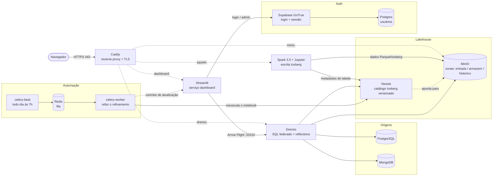

# Data Lakehouse — Dremio + Spark + MinIO + Nessie + PostgreSQL + MongoDB

Stack local de Data Lakehouse, pronta para ser implantada em qualquer projeto: armazenamento em
object store (MinIO), processamento distribuído (Spark), catálogo Iceberg com versionamento tipo git
(Nessie), query engine federada (Dremio) e bancos de origem (PostgreSQL e MongoDB).

Em cima dessa base rodam três camadas, todas subindo com um `docker compose up -d`:

| Camada | O que é |
|---|---|
| **Lakehouse** | MinIO + Spark + Nessie + Dremio, com as zonas `entrada` / `armazem` / `historico` |
| **Painel** | app Streamlit com login, servido por HTTPS pelo proxy — hoje com os BIs do Selo Ambiental 2025 e 2026 |
| **Automação** | Celery: recarrega o dado todo dia às 7h, varre o ambiente e avisa no Telegram |

Toda a identidade da implantação — nome do projeto, prefixo de containers e volumes, nomes das zonas
de armazenamento e credenciais — vem do arquivo `.env`. O `docker-compose.yml` é genérico e não
precisa ser editado para atender um novo cliente.

- Artigo de referência: <https://www.dremio.com/blog/unifying-data-sources-with-dremio-power-a-streamlit-app/>
- Projeto de referência: <https://github.com/AlexMercedCoder/dremio-notebook>

---

## Índice

1. [Arquitetura](#arquitetura)
2. [Requisitos](#requisitos)
3. [Implantar em um novo projeto](#implantar-em-um-novo-projeto)
4. [Passo a passo](#passo-a-passo)
5. [Atualização automática (Celery)](#atualização-automática-celery)
6. [Autenticação do dashboard](#autenticação-do-dashboard)
7. [Painel SEMARH](#painel-semarh)
8. [Notebooks-modelo](#notebooks-modelo)
9. [Imagem do Spark/Jupyter](#imagem-do-sparkjupyter)
10. [Zonas do object store](#zonas-do-object-store)
11. [Portas e endereços](#portas-e-endereços)
12. [Validação de ponta a ponta](#validação-de-ponta-a-ponta)
13. [Segurança](#segurança)
14. [Estrutura do repositório](#estrutura-do-repositório)

---

## Arquitetura



### O caminho do dado

```
  origem            entrada          refinamento         publicação          consumo
 ┌────────┐      ┌───────────┐     ┌────────────┐     ┌───────────┐     ┌────────────┐
 │ banco  │      │  MinIO    │     │   Spark    │     │  Dremio   │     │ Streamlit  │
 │ CSV    │ ───► │ zona      │ ──► │ limpa e    │ ──► │ expõe SQL │ ──► │ gráficos e │
 │ API    │      │ entrada   │     │ agrega     │     │ federado  │     │ mapa       │
 └────────┘      └───────────┘     └─────┬──────┘     └─────▲─────┘     └────────────┘
                                         │ Iceberg          │ lê catálogo
                                         ▼                  │
                                  ┌─────────────┐     ┌───────────┐
                                  │ MinIO       │◄────│  Nessie   │
                                  │ zona armazém│     │ catálogo  │
                                  └─────────────┘     └───────────┘
```

1. **O arquivo chega na zona `entrada`** do MinIO — subido à mão, por script ou por um notebook de
   coleta. Aqui o dado fica **exatamente como veio da origem**, sem tratamento.
2. **O Spark lê, trata e grava como tabela Iceberg** na zona `armazem`. Os arquivos de dados vão
   para o object store; os **metadados da tabela** (quais arquivos formam a versão atual, o schema,
   o histórico) vão para o **Nessie**.
3. **O Dremio enxerga o Nessie como catálogo** e passa a servir aquelas tabelas por SQL — junto com
   o PostgreSQL, o MongoDB e os arquivos soltos do MinIO, tudo na mesma consulta.
4. **O painel consulta o Dremio por Arrow Flight** (`:32010`), um protocolo binário colunar: o
   resultado chega como Arrow e vira `DataFrame` sem serialização intermediária.
5. **O usuário acessa só o Caddy** (443), que termina o TLS e roteia por subdomínio para o painel,
   o Dremio, o MinIO e o Jupyter. Nenhum outro serviço é publicado na rede.

Em paralelo, o **Celery** refaz os passos 2 e 3 todo dia às 7h, varre o ambiente atrás do que mudou
e avisa no Telegram — ver [Atualização automática](#atualização-automática-celery).

### O que cada peça faz

| Peça | O que faz | Por que está aqui |
|---|---|---|
| **MinIO** | Object store compatível com S3, dividido em três zonas | Guarda arquivo bruto e tabela Iceberg pelo mesmo protocolo do S3 — o que roda aqui roda na nuvem sem reescrever caminho |
| **Spark** | Processamento distribuído; lê JDBC/CSV/JSON e escreve Iceberg | É quem transforma. Ler um banco externo inteiro e reescrever em colunar é trabalho de motor, não de query engine |
| **Iceberg** | Formato de tabela sobre os arquivos | Dá `UPDATE`/`DELETE`, evolução de schema e leitura consistente enquanto alguém escreve — o que "pasta de parquet" não dá |
| **Nessie** | Catálogo Iceberg com versionamento tipo git | Sabe qual é a versão atual de cada tabela e permite branch/tag: dá para testar uma carga num branch sem afetar quem consulta o `main` |
| **Dremio** | Query engine federada + camada semântica (spaces/views) | Junta lakehouse, PostgreSQL e MongoDB numa consulta só, sem copiar dado, e serve o resultado por Arrow Flight |
| **Streamlit** | O painel que o usuário final abre | Interface em Python puro: quem escreve o notebook escreve a tela, sem stack de frontend |
| **Caddy** | Proxy reverso com TLS automático | Único serviço exposto: emite os certificados sozinho (CA interna) e mantém o resto fora da rede |
| **Supabase GoTrue** | Login do painel (usuários, sessões, tokens) | Autenticação pronta e testada, com banco próprio — o painel não guarda senha |
| **Celery + Redis** | Agenda e executa a carga diária; Redis é a fila | Tira o "alguém precisa rodar o notebook" do processo, e dá histórico do que rodou |
| **PostgreSQL / MongoDB** | Bancos de origem de exemplo | Representam os sistemas que já existem na casa e viram fonte federada no Dremio |

### Os 13 serviços

| Serviço | Papel | Publicado |
|---|---|---|
| `caddy` | Proxy reverso com TLS — **único** ponto de entrada da rede | 80/443 |
| `dashboard` | Painel Streamlit | via proxy |
| `dremio` | Query engine federada (UI + SQL + Arrow Flight) | via proxy / loopback |
| `spark` | Spark + JupyterLab (escrita Iceberg, notebooks) | via proxy / loopback |
| `minio` | Object store (as três zonas) | via proxy / loopback |
| `nessie` | Catálogo Iceberg versionado | loopback |
| `postgres` · `mongo` | Bancos de origem | loopback |
| `supabase-auth` · `supabase-db` | Login do painel (GoTrue + banco próprio) | loopback |
| `redis` | Fila do Celery | rede interna |
| `celery-beat` · `celery-worker` | Agenda e executa a atualização diária | rede interna |

Os serviços ficam numa rede Docker chamada `interna` (que o Compose publica como
`${PROJETO}_interna`). **Dentro** dessa rede eles se enxergam pelo nome do serviço —
`minio:9000`, `nessie:19120`, `dremio:9047`, `supabase-auth:9999`. **De fora**, o único ponto de
entrada na rede é o **proxy Caddy** (443), que serve as interfaces web por subdomínio e com TLS; os
demais serviços só publicam em `127.0.0.1`. Ver [Portas e endereços](#portas-e-endereços).

---

## Requisitos

| Item | Mínimo | Observação |
|---|---|---|
| Docker Engine | 24+ | validado com 29.6.1 |
| Docker Compose | v2+ | validado com v5.3.0 |
| RAM livre | **8 GB** (12 GB confortável) | Dremio ~4 GB; Spark + Jupyter 2–3 GB; a carga diária sobe um driver Spark de ~1 GB por ~1,5 min |
| Disco livre | ~15 GB | as imagens somam ~8 GB |
| CPU | x86_64 com AVX | obrigatório para MongoDB 5.0+ |
| Kernel Linux | qualquer | **se ≥ 6.19, use `mongo:7.0`** — o MongoDB 8.x não sobe em kernel ≥ 6.19 |
| Internet | sim | imagens e, no primeiro run do Spark, os JARs do Iceberg/Nessie |

```bash
docker --version && docker compose version
free -h                          # precisa de RAM DISPONÍVEL, não total
df -h .
grep -o -m1 avx2 /proc/cpuinfo   # deve imprimir "avx2"
uname -r                         # 6.19 ou maior: MongoDB 8.x não sobe
```

Com menos de 8 GB disponíveis o Dremio morre por OOM sem mensagem clara e o container entra em loop
de restart. O compose já limita o heap dele a 2 GB para caber em máquinas apertadas.

---

## Implantar em um novo projeto

Esta stack é whitelabel. Para uma nova implantação:

**1. Escolha o identificador do projeto e confirme que está livre.**

Isto não é formalidade. `docker volume create` num volume que já existe **retorna sucesso** e
devolve o volume existente — não há erro. Se `PROJETO` colidir com outra stack no mesmo host, você
grava dentro dos dados dela. Confira os quatro namespaces:

```bash
NOME=plataforma
docker ps -a      --format '{{.Label "com.docker.compose.project"}}' | sort -u | grep -x "$NOME"
docker volume ls  --format '{{.Name}}'  | grep "^${NOME}_"
docker ps -a      --format '{{.Names}}' | grep "^${NOME}_"
docker network ls --format '{{.Name}}'  | grep "^${NOME}_"
```

Os quatro precisam voltar vazios.

**2. Escreva o `.env`** (copie de `.env.example` e preencha). O arquivo completo, com todas as
variáveis e comentários, é o `.env.example`; o essencial:

```ini
# identidade: nome do projeto Compose, prefixo dos containers e dos volumes
PROJETO=plataforma

# zonas do object store (buckets do MinIO)
ZONA_ENTRADA=entrada
ZONA_ARMAZEM=armazem
ZONA_HISTORICO=historico

MINIO_ROOT_USER=minio_admin
MINIO_ROOT_PASSWORD=troque-esta-senha
POSTGRES_USER=postgres_admin
POSTGRES_PASSWORD=troque-esta-senha
POSTGRES_DB=nome_do_banco
MONGO_INITDB_ROOT_USERNAME=mongo_admin
MONGO_INITDB_ROOT_PASSWORD=troque-esta-senha

# --- autenticação (Supabase) e proxy — obrigatórias, o compose falha sem elas ---
# gere cada segredo: python3 -c "import secrets; print(secrets.token_urlsafe(48))"
JWT_SECRET=troque-por-um-valor-forte      # DEVE ser igual ao JWT_SECRET do vars.env
SUPABASE_DB_PASSWORD=troque-esta-senha
JUPYTER_TOKEN=gere-um-token               # sem ele o JupyterLab nem sobe
DOMAIN=localhost                          # subdomínios do proxy: dashboard./dremio./...
```

Senhas do MinIO precisam de **no mínimo 8 caracteres**. Evite `$`, `&`, `)` e `!`: exigem escape em
YAML e em shell, e são a origem da maioria dos "senha incorreta" aqui.

O **dashboard** tem um segundo arquivo, `streamlit_test_jupyter/vars.env` (copie de
`vars.env.example`), com as credenciais do Dremio, o `JWT_SECRET` (idêntico ao do `.env`), o
`COOKIE_SECRET` e o usuário master. Ver [Autenticação do dashboard](#autenticação-do-dashboard).

**3. Troque os dados de exemplo.** Os seeds em `seed/` são de demonstração — substitua pelos do
projeto. Lembre que `docker-entrypoint-initdb.d` só roda com o volume de dados vazio.

**4. Suba.** Siga o [passo a passo](#passo-a-passo) a partir do passo 2.

Nada disso exige editar o `docker-compose.yml`.

### Trocar os nomes das zonas

Basta editar `ZONA_*` no `.env` — mas **só antes da primeira carga**. Os caminhos gravados nos
metadados Iceberg são absolutos (`s3a://armazem/...`), então renomear um bucket que já tem tabelas
quebra as tabelas. Se precisar migrar depois, recrie as tabelas na zona nova em vez de renomear o
bucket, e ajuste o `AWS root path` da fonte Nessie no Dremio.

---

## Passo a passo

### Passo 1 — Preparar diretórios e segredos

```bash
cd dremio-spark-minio

# os diretórios de seed precisam existir antes do up
mkdir -p seed/minio-data seed/postgres seed/mongo seed/notebook-seed
```

Copie os dois arquivos de configuração dos templates e preencha conforme
[Implantar em um novo projeto](#implantar-em-um-novo-projeto). O Compose lê o `.env`
automaticamente. Ambos já estão no `.gitignore` do repositório — **nunca** os versione.

```bash
cp .env.example .env
cp streamlit_test_jupyter/vars.env.example streamlit_test_jupyter/vars.env
```

### Passo 2 — Subir a stack

```bash
docker compose config -q && echo "sintaxe OK"   # valida antes de subir
docker compose build spark                      # imagem própria; primeira vez leva minutos
docker compose up -d
docker compose ps
```

Isso sobe **tudo**, inclusive o painel: o serviço `dashboard` roda o Streamlit no boot da stack
(nada de iniciar à mão pelo Jupyter). Ele usa a mesma imagem do `spark`, então o
`docker compose build spark` acima já serve para os dois. Antes do primeiro `up`, preencha o
`streamlit_test_jupyter/vars.env` ([passo 10](#passo-10--streamlit)) — sem ele o painel sobe, mas
não consulta o Dremio nem faz login.

Em máquina apertada, suba em etapas:

```bash
docker compose up -d minio nessie postgres mongo
docker compose up -d dremio spark
docker compose up -d dashboard caddy
```

### Passo 3 — Validar que tudo respondeu

```bash
curl -sf http://localhost:9000/minio/health/live  && echo "MinIO   OK"
curl -sf http://localhost:19120/api/v2/config     && echo "Nessie  OK"
curl -skf -o /dev/null https://dremio.localhost    && echo "Dremio  OK (via proxy)"
curl -sf -o /dev/null http://localhost:8080       && echo "Spark   OK"
curl -sf  http://localhost:9999/health             && echo "GoTrue  OK"
curl -skf -o /dev/null https://dashboard.localhost  && echo "Painel  OK (via proxy)"
```

```bash
docker compose exec redis redis-cli ping                            # PONG
docker compose exec celery-worker celery -A celery_app.tarefas inspect ping   # 1 node online
```

Todos os containers devem aparecer `Up` em `docker compose ps`; `dashboard`, `minio`, `postgres`,
`redis`, `supabase-db` e `supabase-auth` têm healthcheck e ficam `Up (healthy)`. O `dashboard` espera o
`supabase-auth` ficar saudável antes de iniciar, então leva alguns segundos a mais que os demais.

O Dremio leva **1 a 3 minutos** no primeiro boot. Acompanhe com `docker compose logs -f dremio`.

A resposta do Nessie precisa conter `"maxSupportedApiVersion" : 2` — o Dremio só conecta em servidor
Nessie com API v2 (versão ≥ 0.59.0).

### Passo 4 — MinIO: zonas e credencial de aplicação

Console web: <https://minio.localhost>, com as credenciais do `.env`.

As três zonas são criadas pelo entrypoint no primeiro boot. Para conferir ou recriar à mão:

```bash
docker compose exec minio sh -c '
  mc alias set local http://localhost:9000 "$MINIO_ROOT_USER" "$MINIO_ROOT_PASSWORD" &&
  mc mb -p local/$ZONA_ENTRADA local/$ZONA_ARMAZEM local/$ZONA_HISTORICO &&
  mc cp --recursive /seed-entrada/ local/$ZONA_ENTRADA/ &&
  mc ls local'
```

Deve listar `armazem/`, `entrada/` e `historico/`. O papel de cada uma está em
[Zonas do object store](#zonas-do-object-store).

Crie uma **access key dedicada** para Spark e Dremio — não use a credencial root:

```bash
docker compose exec minio sh -c '
  mc alias set local http://localhost:9000 "$MINIO_ROOT_USER" "$MINIO_ROOT_PASSWORD" &&
  mc admin user svcacct add local "$MINIO_ROOT_USER"'
```

Guarde o `Access Key` e o `Secret Key` — são usados nos passos 6, 7 e 9.

### Passo 5 — Dremio: criar o usuário administrador

Abra <https://dremio.localhost>. No primeiro acesso o Dremio pede para criar o admin. As credenciais vão
para `streamlit_test_jupyter/vars.env` no passo 10.

### Passo 6 — Dremio: MinIO como fonte S3

**Add Source → Amazon S3**

| Campo | Valor |
|---|---|
| Name | `minio` |
| Authentication | AWS access key |
| AWS Access Key / Secret Key | as do passo 4 |
| Encrypt connection | **desmarcado** (o MinIO local é HTTP) |

Em **Advanced Options**, marque `Enable compatibility mode` e adicione as Connection Properties:

| Propriedade | Valor |
|---|---|
| `fs.s3a.path.style.access` | `true` |
| `fs.s3a.endpoint` | `minio:9000` *(sem `http://`)* |
| `dremio.s3.compat` | `true` |

Salve. As zonas aparecem na árvore de datasets. Abra `minio → entrada` e promova `employees.csv` a
dataset para testar.

### Passo 7 — Dremio: Nessie como catálogo Iceberg

**Add Source → Nessie**

| Campo | Valor |
|---|---|
| Name | `nessie` |
| Nessie endpoint URL | `http://nessie:19120/api/v2` |
| Nessie authentication | `None` |
| Storage provider | AWS (S3) |
| AWS root path | `armazem` *(o valor de `ZONA_ARMAZEM`)* |
| AWS Access/Secret Key | as do passo 4 |
| Encrypt connection | **desmarcado** |

Em **Advanced Options**, as mesmas três propriedades do passo 6.

### Passo 8 — Dremio: PostgreSQL e MongoDB

**Add Source → PostgreSQL**

| Campo | Valor |
|---|---|
| Host | `postgres` |
| Port | `5432` *(porta interna, não a 5435 publicada)* |
| Database | valor de `POSTGRES_DB` |
| Username / Password | do `.env` |

**Add Source → MongoDB**

| Campo | Valor |
|---|---|
| Host | `mongo` |
| Port | `27017` |
| Username / Password | do `.env` |
| Authentication database | `admin` |

### Passo 9 — Spark + Jupyter: gravar uma tabela Iceberg

Abra o JupyterLab em <https://jupyter.localhost/?token=SEU_TOKEN> (o `JUPYTER_TOKEN` do `.env`). Os modelos prontos estão em
`notebooks/` — comece por `00_ambiente.ipynb` e veja [Notebooks-modelo](#notebooks-modelo). O código
abaixo é o mesmo que o `lakehouse.py` encapsula, mostrado por extenso para referência.

```python
from pyspark.sql import SparkSession

MINIO_KEY    = "COLE_A_ACCESS_KEY_DO_PASSO_4"
MINIO_SECRET = "COLE_A_SECRET_KEY_DO_PASSO_4"
S3_ENDPOINT  = "http://minio:9000"
NESSIE_URI   = "http://nessie:19120/api/v2"
WAREHOUSE    = "s3a://armazem/"          # valor de ZONA_ARMAZEM

PACKAGES = ",".join([
    "org.apache.iceberg:iceberg-spark-runtime-3.5_2.12:1.9.2",
    # 0.106.0 e a ULTIMA compilada para Java 11, que e o Java desta imagem do Spark.
    # 0.107+ exige Java 17 e quebra com UnsupportedClassVersionError. Ver nota abaixo.
    "org.projectnessie.nessie-integrations:nessie-spark-extensions-3.5_2.12:0.106.0",
    "org.apache.hadoop:hadoop-aws:3.3.4",
    "software.amazon.awssdk:bundle:2.24.8",
    "software.amazon.awssdk:url-connection-client:2.24.8",
])

spark = (
    SparkSession.builder.appName("iceberg-nessie-minio")
    .config("spark.jars.packages", PACKAGES)
    .config("spark.sql.extensions",
            "org.apache.iceberg.spark.extensions.IcebergSparkSessionExtensions,"
            "org.projectnessie.spark.extensions.NessieSparkSessionExtensions")
    .config("spark.sql.catalog.nessie", "org.apache.iceberg.spark.SparkCatalog")
    .config("spark.sql.catalog.nessie.catalog-impl", "org.apache.iceberg.nessie.NessieCatalog")
    .config("spark.sql.catalog.nessie.uri", NESSIE_URI)
    .config("spark.sql.catalog.nessie.ref", "main")
    .config("spark.sql.catalog.nessie.authentication.type", "NONE")
    .config("spark.sql.catalog.nessie.warehouse", WAREHOUSE)
    .config("spark.sql.catalog.nessie.io-impl", "org.apache.iceberg.aws.s3.S3FileIO")
    .config("spark.sql.catalog.nessie.s3.endpoint", S3_ENDPOINT)
    .config("spark.sql.catalog.nessie.s3.path-style-access", "true")
    .config("spark.hadoop.fs.s3a.endpoint", S3_ENDPOINT)
    .config("spark.hadoop.fs.s3a.path.style.access", "true")
    .config("spark.hadoop.fs.s3a.access.key", MINIO_KEY)
    .config("spark.hadoop.fs.s3a.secret.key", MINIO_SECRET)
    .getOrCreate()
)

# o namespace vira o prefixo dentro do armazém: s3a://armazem/limpeza/
spark.sql("CREATE NAMESPACE IF NOT EXISTS nessie.limpeza")
spark.sql("""
    CREATE TABLE IF NOT EXISTS nessie.limpeza.vendas (id INT, produto STRING, valor DOUBLE)
    USING iceberg TBLPROPERTIES ('format-version'='2')
""")
spark.sql("INSERT INTO nessie.limpeza.vendas VALUES (1,'Notebook',3500.0), (2,'Monitor',1200.0)")
spark.sql("SELECT * FROM nessie.limpeza.vendas ORDER BY id").show()
```

Notas:

- O primeiro `getOrCreate()` baixa os JARs do Maven Central: 1 a 3 minutos, e **exige internet**.
  Depois ficam em cache no `~/.ivy2` do container.
- **A versão das extensões Nessie não é livre.** A imagem `alexmerced/spark35nb` roda **Java 11**, e
  `nessie-spark-extensions` a partir da **0.107** é compilada para Java 17. Usar a 0.108.4 (mesma
  versão do servidor) falha no primeiro `spark.sql()`:

  ```
  java.lang.UnsupportedClassVersionError: org/projectnessie/nessie/cli/grammar/ParseException
  has been compiled by a more recent version of the Java Runtime (class file version 61.0),
  this version of the Java Runtime only recognizes class file versions up to 55.0
  ```

  Use **0.106.0**, a última em bytecode Java 11. O cliente 0.106.0 conversa normalmente com o
  servidor 0.108.4 pela API v2; as versões não precisam coincidir.
- Mantenha `'format-version'='2'`. O Iceberg 1.10+ disponibilizou o formato v3, e o Dremio 26 lê com
  segurança apenas v1/v2. Por isso o exemplo fixa o Iceberg em `1.9.2`; com `1.11.0`, declarar
  `format-version=2` passa a ser obrigatório.
- Depois do `INSERT`, volte ao Dremio: a tabela aparece em `nessie → limpeza → vendas`. É o teste que
  prova que Spark, Nessie, MinIO e Dremio estão realmente integrados.

Branches do Nessie funcionam como no git:

```python
spark.sql("CREATE BRANCH IF NOT EXISTS experimento IN nessie FROM main")
spark.sql("USE REFERENCE experimento IN nessie")
```

### Passo 10 — Streamlit

Copie o template e preencha `streamlit_test_jupyter/vars.env`. Ele tem três blocos: a conta de
serviço do Dremio (do passo 5, usada para **consultar** o lakehouse), a configuração do Supabase
(login) e o cookie de sessão. Detalhes em [Autenticação do dashboard](#autenticação-do-dashboard).

```bash
cp streamlit_test_jupyter/vars.env.example streamlit_test_jupyter/vars.env
# gere os segredos:
python3 -c "import secrets; print(secrets.token_urlsafe(48))"   # COOKIE_SECRET
```

```ini
# Dremio (conta de serviço que consulta o lakehouse)
DREMIO_USERNAME=seu_usuario
DREMIO_PASSWORD=sua_senha
DREMIO_ENDPOINT=dremio:9047
DREMIO_FLIGHT_ENDPOINT=dremio:32010
# Supabase (login) — SUPABASE_URL usa o nome de serviço na rede Docker.
AUTH_ENABLED=true
SUPABASE_URL=http://supabase-auth:9999
JWT_SECRET=<IDÊNTICO ao JWT_SECRET do .env da stack>
AUTH_MASTER_EMAIL=master@seu-dominio.local
AUTH_MASTER_PASSWORD=<senha forte do master>
COOKIE_SECRET=<32+ caracteres>
```

Os endpoints usam nomes de serviço porque o app roda **dentro** da rede Docker. Os serviços de
autenticação (`supabase-db`, `supabase-auth`) já sobem com o `docker compose up -d` do passo 2.
As consultas ficam em `app_semarh/` — ver [Painel SEMARH](#painel-semarh).

O painel **sobe sozinho** junto com a stack: é o serviço `dashboard`, iniciado pelo
`docker compose up -d` do passo 2 e reiniciado automaticamente (`restart: unless-stopped`). Não é
preciso rodar nada à mão pelo Jupyter. Depois de editar o `vars.env` ou o código do app:

```bash
docker compose restart dashboard      # aplica vars.env / mudanças estruturais
docker compose logs -f dashboard      # acompanha o log do painel
```

Acesse <https://dashboard.localhost> e entre com o usuário **master** (criado no primeiro boot a partir do
`vars.env`). Pela barra lateral → **Administrar usuarios**, crie as contas de quem vai visualizar.

> O Streamlit roda na porta 8501 **dentro** do container e não é publicado no host: o acesso é por
> `https://dashboard.localhost` (proxy Caddy). A pasta chega ao container pelo volume
> `./streamlit_test_jupyter:/workspace/streamlit` — como é bind mount, editar um `.py` recarrega o
> app na hora, sem restart. O serviço usa a mesma imagem do `spark`, então `streamlit` e
> `dremio-simple-query` já estão instalados.
>
> Para desligar o login em desenvolvimento, use `AUTH_ENABLED=false` no `vars.env`.

### Passo 11 — Parar e limpar

```bash
docker compose stop      # pausa, mantém tudo
docker compose down      # remove containers, MANTÉM os volumes nomeados
docker compose down -v   # apaga TAMBÉM os dados de todos os serviços
```

---

---

## Atualização automática (Celery)

Os dados são recarregados **todo dia às 07:00** (`HORA_ATUALIZACAO` no `.env`), no fuso
**America/Fortaleza** — o mesmo usado no agendamento, no carimbo da atualização, nas sessões Spark
e no que o painel exibe. Os serviços sobem com o `docker compose up -d`; não há nada para iniciar
à mão.

| Serviço | Papel |
|---|---|
| `redis` | Fila do Celery (broker + resultados). Efêmero: sem RDB nem AOF |
| `celery-beat` | Agendador — publica a tarefa às 07:00 |
| `celery-worker` | Executa a tarefa. Usa a **mesma imagem do Spark**, porque sobe um driver Spark |

O que a tarefa faz, em [`celery_app/tarefas.py`](celery_app/tarefas.py):

1. **Datasets** — `ALTER TABLE … REFRESH METADATA` nos parquets da zona de entrada, para o Dremio
   enxergar um arquivo novo publicado no MinIO.
2. **DataFrame + análise** — reexecuta os **mesmos notebooks** de refinamento que uma pessoa roda no
   JupyterLab, **um por edição** do Selo Ambiental (`semarh_painel/refinamento_selo_ambiental.ipynb`
   e `..._2025.ipynb`), regravando as tabelas de `refinamento` e os resumos. Não há lógica duplicada
   entre os notebooks e a tarefa — se as validações de **qualquer** um falharem, a tarefa falha e
   **as tabelas antigas continuam no ar**; nada é publicado pela metade. Os notebooks a rodar saem
   de `NOTEBOOK_REFINAMENTO` (lista separada por vírgula), então uma edição nova entra na carga
   diária sem mexer no código da tarefa.
3. **Views** — recria as views curadas do space `refinamento` (pastas pela API REST, views por SQL).
   São elas que o painel consulta, então recriar a cada carga faz a estrutura se curar sozinha: uma
   view apagada por engano volta na execução seguinte. A conferência logo abaixo passa por elas de
   propósito.
4. **Dashboard** — grava o carimbo em `/estado/atualizacao.json` (volume `painel-estado`,
   compartilhado com o serviço `dashboard`). O Streamlit usa esse carimbo como chave de cache:
   o dado novo aparece assim que o refinamento termina, sem esperar o TTL de 5 min.

### Atualizar na hora, pelo painel

No rodapé da barra lateral ficam **a data/hora da última carga** e o botão **"Atualizar dados
agora"**. O botão não processa nada no painel: publica a **mesma** tarefa na fila e acompanha o
andamento numa barra de porcentagem (a etapa longa avança pelo tempo decorrido, usando a duração
da execução anterior como estimativa). Ao terminar, a página recarrega já com o dado novo.

A data/hora exibida é sempre a da última carga concluída — automática ou manual, com a origem entre
parênteses:

```
🕒 Atualizado em: quinta, 13/08/2026 às 11:31 (manual)
```

### Observabilidade: aviso no Telegram + histórico

Toda carga — automática ou manual — gera três registros:

1. **`/estado/atualizacao.json`** — a última carga (quando, origem, duração, dataset de origem e as
   tabelas publicadas com a contagem de linhas). É o que o painel lê para o `🕒 Atualizado em`.
2. **`/estado/historico.jsonl`** — uma linha por execução, append-only. Aparece na sidebar em
   **Histórico**: quando · situação · origem · tabelas atualizadas.
3. **Mensagem no Telegram** — curta, só o que foi publicado:

```
🟢 Dados atualizados
quinta, 13/08/2026 às 13:07

📥 Origem — MinIO, zona entrada
• sermarh_painel/selo_ambiental_2026.parquet — 224 linhas
  no Dremio: minio.entrada."sermarh_painel"."selo_ambiental_2026.parquet"
• sermarh_painel/selo_ambiental_2025.parquet — 224 linhas
  no Dremio: minio.entrada."sermarh_painel"."selo_ambiental_2025.parquet"

📦 Tabelas reescritas — Iceberg na zona armazem do MinIO, catálogo Nessie:
• nessie.refinamento.semarh_painel — 224 linhas
• nessie.refinamento.semarh_painel_2025 — 224 linhas
• nessie.refinamento.semarh_painel_2025_fases — 672 linhas
• nessie.refinamento.semarh_painel_2025_por_criterios — 11 linhas
• nessie.refinamento.semarh_painel_2025_por_selo — 5 linhas
• nessie.refinamento.semarh_painel_fases — 672 linhas
• nessie.refinamento.semarh_painel_por_criterios — 11 linhas
• nessie.refinamento.semarh_painel_por_selo — 5 linhas

Toda carga reescreve as tabelas por inteiro; o número entre parênteses é a
variação de linhas desde a carga anterior.
```

Cada bloco diz **onde o dado mora**: o arquivo de origem fica no MinIO (zona `entrada`) e é servido
pelo Dremio com outro nome; as tabelas são Iceberg na zona `armazem`, catalogadas no Nessie e
consultadas no Dremio como `nessie.refinamento.*`. As tabelas listadas foram **reescritas naquela
execução** — o manifesto é criado, lido e apagado a cada carga, então nada ali é herança de execução
anterior. Como a gravação é integral (`createOrReplace`), elas são reescritas mesmo quando o
conteúdo não muda; é por isso que o bucket `armazem` cresce alguns arquivos Iceberg a cada carga, e
é a variação entre parênteses que diz se o conteúdo mudou de tamanho.

Além do que a carga publica, cada execução faz uma **varredura do ambiente** e avisa o que mudou
desde a carga anterior — inclusive coisa criada por fora do pipeline:

| Onde | O que é comparado | Como é lido |
|---|---|---|
| **Dremio** | sources, spaces, pastas e todos os datasets | `INFORMATION_SCHEMA` (esquemas + tabelas/views) |
| **PostgreSQL** da stack | tabelas e views de todos os schemas | direto do `information_schema` do banco |
| **MinIO** | todos os buckets: arquivos e tamanho | API S3, listando bucket a bucket |

```
Novidades no ambiente:
• Dremio: +1 fonte/space — novo_source
• postgres: +1 tabela(s) — public.pedidos_2027
• MinIO `entrada`: +1 arquivo(s) — carga_marco.parquet
```

Duas decisões que evitam ruído:

- O PostgreSQL é lido **direto do banco**, não pelo Dremio: o Dremio revalida o catálogo das fontes
  no ciclo de metadados dele (1 h por padrão), então uma tabela criada agora demoraria a aparecer.
  Fontes externas (como `siga`) só aparecem pelo catálogo do Dremio, no ritmo dele.
- O **MongoDB** não entra na varredura direta (o cliente Python não está na imagem): coleções novas
  aparecem pelo catálogo do Dremio, no ciclo de metadados dele.
- O bucket do **armazém** entra só pelo agregado (`+18 arquivos, agora 518`): ali estão os arquivos
  internos do Iceberg, com nomes de uuid — listar um a um encheria a mensagem a cada commit.

A lista de tabelas **não é fixa no código**: `lakehouse.gravar()` anota cada tabela publicada num
manifesto da execução (`MANIFESTO_PUBLICACAO`), e a tarefa lê esse manifesto. Qualquer notebook do
pipeline que grave com o helper entra no aviso automaticamente — sem tocar no serviço.

Falha também notifica (🔴), com o fim do log do notebook. Configure no `.env` — **nunca no código**:

| Variável | Para quê |
|---|---|
| `TELEGRAM_BOT_TOKEN` | Token do BotFather |
| `TELEGRAM_CHAT_ID` | Id do grupo (negativo) ou da conversa. Vários, separados por vírgula; em grupo com tópicos, `chat:topico` |
| `TELEGRAM_NOTIFICAR` | `tudo` (padrão), `sucesso`, `falha` ou `nada` |

**Para avisar num grupo:**

1. Adicione **o bot ao grupo**.
2. Mande uma mensagem no grupo que ele consiga ver — por padrão o Telegram liga o *modo privacidade*
   e o bot só enxerga mensagens que começam com `/` ou que o mencionem. Um `/start@seu_bot` resolve;
   promovê-lo a administrador também.
3. Rode o `--descobrir`: o grupo aparece com id **negativo** (`-100…` em supergrupo).
4. Ponha o id no `TELEGRAM_CHAT_ID`, `docker compose up -d celery-worker` e confirme com `--teste`.

Para achar o id: adicione o bot ao destino, mande uma mensagem lá e rode

```bash
docker compose exec celery-worker python3 -m celery_app.notificacao --descobrir   # lista os chats
docker compose exec celery-worker python3 -m celery_app.notificacao --teste       # envia um teste
docker compose exec celery-worker python3 -m celery_app.notificacao               # valida o token
```

Sem token ou sem chat, o envio é um **no-op silencioso**: a atualização não falha por causa da
notificação, e o histórico continua sendo gravado.

```bash
docker compose logs -f celery-worker                                  # acompanhar
docker compose exec celery-worker celery -A celery_app.tarefas call painel.atualizar   # rodar agora
docker compose exec celery-worker cat /estado/atualizacao.json        # último resultado
docker compose exec celery-worker tail -3 /estado/historico.jsonl      # histórico
```

> **Memória**: cada execução sobe um driver Spark (~1,5 min, ~1 GB). Em máquina apertada, evite
> disparar o botão enquanto o Dremio estiver sob carga.
>
> O worker roda com `--concurrency=1` de propósito: duas execuções simultâneas brigariam pelo
> commit no Nessie e pela RAM do driver. Um disparo manual durante a carga diária espera na fila.

---

## Autenticação do dashboard

O dashboard fica atrás de um login. Quem valida o acesso é o **Supabase GoTrue**; o Streamlit
continua consultando o Dremio com a conta de serviço do `vars.env`. Há dois papéis: um **usuário
master** (o único que cria/remove contas) e os **visualizadores**, que só acessam o painel.

### Componentes e o que cada um faz

| Componente | Onde | Função |
|---|---|---|
| `dashboard` (Streamlit) | serviço no `docker-compose.yml`, porta 8501 (só rede interna) | Roda o painel; sobe junto com a stack |
| `supabase-auth` (GoTrue) | serviço no `docker-compose.yml`, porta 9999 | API de autenticação: login, tokens de sessão, `/admin/users` |
| `supabase-db` (Postgres) | serviço no `docker-compose.yml`, sem porta no host | Banco só do GoTrue (usuários e sessões) |
| `docker/supabase-init.sql` | roda no 1º boot do `supabase-db` | Cria o schema `auth` que o GoTrue espera |
| `streamlit_test_jupyter/auth/authentication.py` | app | `require_auth()`: gate de login, tela de entrada e painel do master |
| `.../auth/supabase_client.py` | app | Cliente do GoTrue + Admin API (cria/remove usuários) |
| `.../auth/session.py` | app | Normaliza, renova e valida a sessão |
| `.../auth/cookies.py` | app | Guarda a sessão num cookie **criptografado** no navegador |
| conta de serviço do Dremio | `vars.env` | Usada para **consultar** o lakehouse (não é o login) |

Papéis: o cadastro público fica **desligado** (`SUPABASE_DISABLE_SIGNUP=true`). Só o master cria
contas, pelo painel **"Administrar usuarios"** na barra lateral — que chama a Admin API do GoTrue com
um token `service_role` assinado localmente com o `JWT_SECRET` (nunca vai ao navegador). Depois do
login, a sessão vai para um cookie cifrado (a chave `COOKIE_SECRET` fica no servidor) e o token é
renovado sozinho perto de expirar.

### Onde colocar as variáveis e credenciais

São **dois** arquivos (ambos no `.gitignore`; copie dos `.example`). Gere cada segredo com
`python3 -c "import secrets; print(secrets.token_urlsafe(48))"`.

**1) `.env` da stack** — infra do GoTrue (lido pelo `docker-compose.yml`):

| Variável | Para quê |
|---|---|
| `JWT_SECRET` | Segredo que assina os tokens. **Deve ser idêntico** ao do `vars.env` |
| `SUPABASE_DB_PASSWORD` | Senha do Postgres do GoTrue |
| `SUPABASE_DISABLE_SIGNUP` | `true` = só o master cria contas |
| `SUPABASE_MAILER_AUTOCONFIRM` | `true` = conta criada já entra (sem SMTP local) |
| `SUPABASE_AUTH_PORT` | Porta do GoTrue no host (padrão `9999`) |

**2) `streamlit_test_jupyter/vars.env`** — lido pelo app:

| Variável | Para quê |
|---|---|
| `DREMIO_USERNAME` / `DREMIO_PASSWORD` | Conta de serviço que **consulta** o Dremio |
| `DREMIO_ENDPOINT` / `DREMIO_FLIGHT_ENDPOINT` | Endereços do Dremio na rede Docker |
| `SUPABASE_URL` | `http://supabase-auth:9999` (nome de serviço na rede interna) |
| `AUTH_ENABLED` | `true` liga o login; `false` = modo dev sem login |
| `JWT_SECRET` | **Idêntico** ao do `.env` (o app assina o token de admin com ele) |
| `AUTH_MASTER_EMAIL` / `AUTH_MASTER_PASSWORD` | Credenciais do usuário master |
| `COOKIE_SECRET` | Chave (32+ caracteres) que cifra o cookie de sessão |

### Passo a passo para executar

```bash
# 1. Copie os templates e preencha os segredos (mesmo JWT_SECRET nos dois)
cp .env.example .env
cp streamlit_test_jupyter/vars.env.example streamlit_test_jupyter/vars.env

# 2. Suba a stack — inclui supabase-db, supabase-auth e o dashboard
docker compose up -d

# 3. Confirme que o GoTrue respondeu
curl -sf http://localhost:9999/health && echo " GoTrue OK"

# 4. O dashboard já subiu como serviço (cria o usuário master no primeiro boot)
docker compose logs -f dashboard
```

5. Acesse <https://dashboard.localhost> e entre com `AUTH_MASTER_EMAIL` / `AUTH_MASTER_PASSWORD`.
6. Na barra lateral → **Administrar usuarios**, crie as contas dos visualizadores. Eles entram com
   e-mail e senha e só visualizam o painel.

---

---

## Painel SEMARH

O app Streamlit tem dois níveis de navegação, ambos espelhados na URL: **áreas** (botões na
sidebar, `?setor=`) e **BIs** da área (abas, `?bi=`). Para acrescentar um BI, escreva um módulo em
`app_semarh/bis/<setor>/` com uma função `render(user)` e registre-o na lista do setor em
[`app_semarh/setores.py`](streamlit_test_jupyter/app_semarh/setores.py) — o resto da navegação sai
de graça. Cada setor com BI implementado tem o seu pacote (hoje só `chefia_de_gabinete`).

### BI Selo Ambiental — 2025 e 2026

Duas abas, uma por edição, com a **mesma tela**: o motor fica em
[`bis/chefia_de_gabinete/selo_ambiental.py`](streamlit_test_jupyter/app_semarh/bis/chefia_de_gabinete/selo_ambiental.py)
e cada aba (`seloambi_2025.py`, `seloambi_2026.py`) só declara o que é seu — a tabela, o ano e o
notebook a citar quando a consulta falha. Isso é possível porque os dois refinamentos entregam o
**mesmo contrato de colunas**. As chaves de widget e de URL são prefixadas pela edição
(`?selo2025_mun=…`), então o filtro de uma aba não vaza na outra.

O que difere entre as edições vem do próprio dado, sem `if` por ano na tela:

| | 2025 | 2026 |
|---|---|---|
| Municípios não postulados | 12 (a situação entra no filtro e no mapa) | 0 |
| Coluna `Auditor` na tabela | sim — a fonte traz quem analisou cada fase | não existe na fonte |
| Nome do município na fonte | CAIXA ALTA, normalizado no refinamento | já vem em caixa mista |

Cada aba lê a tabela de fases da sua edição (grão: 1 linha por município × fase) e tem quatro
visões, na mesma nomenclatura do painel da SEMARH no Looker Studio:

| Visão | O que mostra |
|---|---|
| 1ª / 2ª / 3ª fase | Cartões, distribuição por selo e por critérios, mapa e tabela daquela fase |
| Balanço anual | Os três funis lado a lado + tabela com resultado e pontos das três fases |

A **3ª fase é o padrão** — é o resultado final da edição. As fases 1 e 2 são parciais; a **1ª fase é
a publicada no painel antigo**, então é nela que os números batem com o Looker Studio (cartões,
barras e tabela conferem indicador por indicador).

O que o painel faz além do espelhamento:

- **Filtros** por território, situação e **município** (vazio = todos), persistidos na URL — dá para
  mandar o link já filtrado.
- **Clique nas barras** de "tipo de selo" ou "critérios atendidos" recorta o mapa e a tabela; os dois
  gráficos combinam em E. Trocar de fase ou de filtro limpa a seleção.
- **Mapa** com o Piauí inteiro sempre enquadrado (o zoom não pula ao filtrar), círculo proporcional
  à pontuação e cor por parâmetro escolhido: resultado, território, critérios, pontuação ou pacto
  ambiental.
- **Rodapé** com a data da última carga e, na sidebar, o botão de atualizar na hora.

### Duas coisas que o dado ensina

**O selo sai do número de critérios, não da pontuação.** A regra — conferida nas três fases das duas
edições, que a usam igual — é `0–2 → não elegível · 3 → Selo C · 4–5 → Selo B · 6+ → Selo A`. As pontuações se
sobrepõem: há Selo C com mais pontos que Selo A. Por isso a tabela mostra critérios ao lado dos
pontos, e as barras de critérios saem na cor do selo que aquela faixa produz. O painel **deriva a
regra do próprio dado** (resultado predominante de cada quantidade de critérios), então ela
acompanha se a edição mudar.

**A chave do município é o código IBGE, não o nome.** A coluna `cod_ibge` (do campo `aux4` da fonte)
é o código sem o prefixo do estado — `2200000 + cod_ibge`. O nome não serve: a dimensão da casa
grava `Nazária do Piauí` onde a fonte grava `Nazária`.

O refinamento também corrige uma ambiguidade da origem: município **sem habilitação fica sem
apuração** (`NULL`), não com `0` critérios. No gráfico de critérios, porém, esses municípios entram
no balde `0` para bater com o painel de origem — a legenda abaixo do gráfico diz quantos são.

**Nome de município não é chave nem entre edições.** Por isso o refinamento de 2025 normaliza a
caixa (`SÃO GONÇALO DO PIAUÍ` → `São Gonçalo do Piauí`, com conectivos em minúscula, romanos em
maiúscula e letra maiúscula depois do apóstrofo): 222 dos 224 nomes passam a bater com os de 2026,
e os 2 restantes divergem na própria fonte. Comparar as duas edições continua sendo por `cod_ibge`.

## Notebooks-modelo

A pasta `notebooks/` traz modelos prontos para conectar fontes externas, tratar os dados e
entregá-los ao Streamlit. Ela é montada no container, então o que você editar no JupyterLab
(<https://jupyter.localhost>) fica versionado no repositório.

```
    origem externa                 tratamento                    consumo
  ┌────────────────┐          ┌────────────────┐          ┌────────────────┐
  │ 01 PostgreSQL  │          │                │          │                │
  │ 02 MySQL       │ ──────►  │ 10_tratamento  │ ──────►  │  20_publicar   │
  │ 03 CSV         │          │                │          │   → Streamlit  │
  │ 04 JSON        │          │                │          │                │
  └────────────────┘          └────────────────┘          └────────────────┘
       coleta            limpeza → refinamento              Arrow Flight
```

| Notebook | O que faz |
|---|---|
| `00_ambiente.ipynb` | Confere se MinIO, Nessie e Dremio respondem. **Rode primeiro.** |
| `01_origem_postgres.ipynb` | Lê tabela de PostgreSQL externo via JDBC → `coleta` |
| `02_origem_mysql.ipynb` | Idem para MySQL/MariaDB |
| `03_origem_csv.ipynb` | Lê CSV da zona de entrada → `coleta` |
| `04_origem_json.ipynb` | Lê JSON, inclusive aninhado → `coleta` |
| `10_tratamento.ipynb` | `coleta` → `limpeza` → `refinamento` |
| `20_publicar.ipynb` | Confere a ponte Dremio → Arrow Flight → Streamlit |
| `lakehouse.py` | Módulo comum: sessão Spark, leitura, escrita, perfil |

Detalhes de uso em [`notebooks/README.md`](notebooks/README.md).

Além dos modelos, `notebooks/semarh_painel/` é o pipeline **em produção** do painel — um notebook
por edição do Selo Ambiental (`refinamento_selo_ambiental.ipynb` para 2026,
`refinamento_selo_ambiental_2025.ipynb` para 2025). Cada um lê o parquet da zona de entrada, refina
as três fases da sua edição e publica a tabela principal, a de fases e os dois resumos. São os
mesmos notebooks que o serviço de [atualização automática](#atualização-automática-celery)
reexecuta — não há lógica duplicada entre o que a pessoa roda no JupyterLab e o que o robô roda às
7h. Os dois entregam o **mesmo contrato de colunas**, que é o que permite as duas abas do painel
compartilharem o mesmo código de tela.

| Edição | Notebook | Tabelas publicadas |
|---|---|---|
| 2026 | `refinamento_selo_ambiental.ipynb` | `refinamento.semarh_painel`, `..._fases`, `..._por_selo`, `..._por_criterios` |
| 2025 | `refinamento_selo_ambiental_2025.ipynb` | `refinamento.semarh_painel_2025`, `..._2025_fases`, `..._2025_por_selo`, `..._2025_por_criterios` |

No Dremio, as views são organizadas em pastas que espelham a navegação do painel —
**setor → família de BI → edição** — e por isso os nomes dos datasets se repetem nas duas edições:
quem carrega o ano é a pasta, não o nome.

```
refinamento/
└── semarh_painel/
    └── chefia_gabinete/
        └── selos_ambientais/
            ├── selos_ambientais_2025/
            │   ├── selo_ambiental            → nessie.refinamento.semarh_painel_2025
            │   ├── selo_ambiental_fases      → ..._2025_fases
            │   ├── por_tipo_de_selo          → ..._2025_por_selo
            │   └── por_criterios_atendidos   → ..._2025_por_criterios
            └── selos_ambientais_2026/
                ├── selo_ambiental            → nessie.refinamento.semarh_painel
                ├── selo_ambiental_fases      → ..._fases
                ├── por_tipo_de_selo          → ..._por_selo
                └── por_criterios_atendidos   → ..._por_criterios
```

**É por essas views que o painel lê** — não pela tabela Iceberg. A view é o contrato: o nome físico
no Nessie continua achatado (`semarh_painel_2025_fases`, definido pelo `gravar()` do notebook) e pode
ser renomeado, ganhar um filtro ou uma coluna calculada sem que o Streamlit saiba.

Para a dependência não virar fragilidade, **a carga recria as views toda vez** (etapa 3 da tarefa,
logo após o refinamento). Uma view apagada por engano volta na próxima execução, e a estrutura de
pastas deixa de depender de alguém tê-la criado na mão. A conferência final da tarefa consulta pelo
**mesmo caminho que o painel usa**, então uma view quebrada acusa na hora da carga em vez de derrubar
o painel depois.

Pastas em *space* não se criam por SQL (`CREATE FOLDER` só vale para fonte versionada) e
`CREATE VIEW` não cria os níveis intermediários — por isso as pastas vão pela API REST do catálogo e
as views por SQL.

### As três camadas

| Camada | Pergunta que responde | O que entra |
|---|---|---|
| `coleta` | *o que a origem mandou?* | dado como veio, sem tratamento |
| `limpeza` | *o dado está correto?* | tipos, nulos, duplicatas, validação |
| `refinamento` | *está pronto para uso?* | joins, agregações, regras de negócio |

O Streamlit lê **só do refinamento**. Separar as camadas permite corrigir uma regra de negócio sem
reprocessar a ingestão, e auditar em que ponto um número mudou. Cada camada é um namespace no
Nessie e um prefixo dentro do armazém — `coleta.clientes` fica em
`s3a://armazem/coleta/clientes_<uuid>/`.

### O módulo `lakehouse.py`

Evita repetir a configuração do Spark em cada notebook e lê tudo do ambiente, então nenhuma senha
da stack aparece em código:

```python
from lakehouse import sessao, ler_jdbc, ler_arquivo, gravar, perfil, listar

spark = sessao("meu-notebook")
df = ler_jdbc(spark, tipo="postgres", host="10.0.0.5", banco="vendas",
              tabela="public.pedidos", usuario="app", senha="...")
perfil(df)                       # linhas, tipos, nulos, distintos
gravar(df, "coleta.pedidos")     # tabela Iceberg no catálogo
```

As versões de Iceberg e das extensões Nessie estão fixadas ali com o motivo ao lado — não mexa sem
necessidade.

`gravar()` também anota a tabela e a contagem de linhas no manifesto da execução quando a variável
`MANIFESTO_PUBLICACAO` existe — é assim que a [notificação](#observabilidade-aviso-no-telegram--histórico)
sabe o que foi publicado sem ninguém listar tabela na mão. Fora do serviço de atualização a variável
não existe e o registro é ignorado.

### Fontes além das quatro

`ler_jdbc` serve para qualquer banco cujo driver você adicione:

```python
spark = sessao("oracle", pacotes_extra=["com.oracle.database.jdbc:ojdbc11:23.5.0.24.07"])
```

O Dremio, por sua vez, conecta direto em 24 tipos de fonte (Oracle, SQL Server, DB2, Snowflake,
Elasticsearch, entre outras) sem passar pelo Spark — útil quando você só quer consultar, não
materializar. Nesse caso a fonte é criada na UI do Dremio e o Streamlit já a enxerga.

> **A stack não inclui um servidor MySQL.** O notebook 02 e o conector do Dremio funcionam, mas
> apontam para um MySQL externo. Se precisar de um local, adicione ao compose.

---
## Imagem do Spark/Jupyter

Quatro serviços rodam a **mesma** imagem própria — `spark`, `dashboard`, `celery-worker` e
`celery-beat` —, construída a partir de [`docker/spark/Dockerfile`](docker/spark/Dockerfile). As bibliotecas ficam **dentro da imagem**, não
num `pip install` de entrypoint — que atrasaria todo boot e se perderia a cada recriação do
container.

```bash
docker compose build spark          # construir (a primeira vez leva alguns minutos)
docker compose up -d spark
docker compose build --no-cache spark   # reconstruir do zero
```

Como a imagem é compartilhada, construir o `spark` já deixa os outros três prontos — o que muda é só
o entrypoint (Jupyter/Spark, `streamlit run`, `celery worker`, `celery beat`). Depois de reconstruir,
recrie todos: `docker compose up -d spark dashboard celery-worker celery-beat`.

O Celery entra numa **camada própria no fim do Dockerfile**, não no `requirements.txt`: assim mexer
nele não invalida o cache do `pip` pesado e o rebuild leva segundos.

> Editar código em `celery_app/` (bind mount) **não** basta: o processo já importou o módulo. Use
> `docker compose restart celery-worker` — um `up -d` sem mudança no serviço não recria o container.

Para adicionar bibliotecas, edite [`docker/spark/requirements.txt`](docker/spark/requirements.txt) e
reconstrua. Não use `!pip install` na célula do notebook a não ser para teste rápido: some quando o
container é recriado.

### O que vem instalado

| Área | Bibliotecas |
|---|---|
| Dados | pandas, numpy, scipy, pyarrow, polars, duckdb, openpyxl |
| Visualização | matplotlib, seaborn, plotly, altair, folium, missingno |
| Machine learning | scikit-learn, xgboost, lightgbm, catboost, imbalanced-learn |
| Explicabilidade e tuning | shap, optuna |
| Experimentos | mlflow |
| Séries temporais | statsmodels, prophet |
| Deep learning | tensorflow, torch, keras |
| Linguagem natural | nltk, spacy *(sem modelos — ver abaixo)* |
| Geoespacial | geopandas, shapely, pyproj, pyogrio |
| Lakehouse | pyspark (+ MLlib), pyiceberg, boto3, minio |
| App | streamlit, dremio-simple-query, python-dotenv |

Modelos de NLP não vêm no pacote, porque pesam e nem todo projeto usa. Descomente as linhas
correspondentes no Dockerfile e reconstrua:

```dockerfile
RUN python -m spacy download pt_core_news_sm
RUN python -m nltk.downloader -d /usr/share/nltk_data stopwords punkt
```

### Duas travas que não devem sair do requirements

```
protobuf>=4.25,<5
numpy<2
```

A imagem base vem com `protobuf 7.x`, mas o TensorFlow 2.17 exige `<5`. Sem a trava, o TF importa
cuspindo `AttributeError: 'MessageFactory' object has no attribute 'GetPrototype'` — funciona
parcialmente, e falha em pontos difíceis de diagnosticar. A trava do numpy protege TensorFlow 2.17 e
torch 2.4, que não funcionam com numpy 2.x.

O Dockerfile termina com uma verificação de import: se uma instalação nova quebrar numpy, TF, torch
ou pyspark, **a construção falha ali** em vez de o problema aparecer semanas depois num notebook.

### Tamanho

A imagem base já tem ~17 GB (torch e tensorflow compilados com CUDA); esta camada leva o total a
~18 GB. Se espaço for problema, corte do `requirements.txt` o que não usar — ou troque torch e
tensorflow pelas variantes CPU, que economizam vários GB:

```
torch --index-url https://download.pytorch.org/whl/cpu
```

> **Sem GPU.** Apesar do build CUDA, não há passagem de GPU configurada no compose. torch e
> tensorflow rodam em CPU.

### Spark MLlib x scikit-learn

Os dois estão disponíveis e resolvem problemas diferentes: `scikit-learn` treina em memória num nó
só; `pyspark.ml` distribui pelo cluster. Para o volume que esta stack local comporta, scikit-learn
quase sempre basta e é mais simples.

O caminho natural no notebook é usar o Spark para ler e agregar o volume grande, e `.toPandas()` no
resultado já reduzido para entregar ao scikit-learn ou ao matplotlib. Cuidado: `.toPandas()` traz
tudo para a memória do driver, limitada a 1 GB em `lakehouse.py` — passe o tamanho desejado em
`sessao(memoria="4g")` se precisar de mais.

---
## Zonas do object store

O MinIO é organizado em **três buckets**, chamados aqui de zonas. Os nomes vêm do `.env`, então o
padrão se adapta a qualquer projeto sem tocar no compose.

| Zona | Bucket | O que guarda | Quem escreve | Formato |
|---|---|---|---|---|
| Entrada | `entrada` | Arquivos como chegam da origem, sem catálogo | ingestão, cargas manuais | CSV, JSON, Parquet solto |
| Armazém | `armazem` | Tabelas gerenciadas pelo catálogo Iceberg/Nessie | Spark e Dremio | Iceberg (Parquet + metadados) |
| Histórico | `historico` | Cargas antigas, backups, material de descarte | rotinas de arquivamento | qualquer |

```
entrada/                      aterrissagem — nada aqui é confiável ainda
├── employees.csv
├── departments.csv
└── salaries.csv

armazem/                      warehouse ÚNICO do catálogo Nessie
├── coleta/                   ← namespace (camada), não bucket
│   └── funcionarios_<uuid>/
│       ├── 0_0_0.parquet           os dados
│       └── metadata/               o que faz ser tabela Iceberg
│           ├── *.metadata.json     schema + lista de snapshots
│           └── *.avro              manifests: quais arquivos valem em cada versão
└── limpeza/
    └── vendas_<uuid>/

historico/                    vazio até você criar uma rotina de arquivamento
```

O `metadata/` é o que separa uma tabela Iceberg de um monte de Parquet solto: o `.metadata.json`
guarda schema e a lista de snapshots, e os `.avro` são os manifests que dizem quais arquivos de dados
pertencem a cada versão. É daí que vêm o time travel e a leitura consistente. O Nessie não guarda
dado nenhum — ele aponta, por branch, para qual `metadata.json` é o atual. O sufixo UUID no nome da
pasta existe para que branches diferentes não colidam.

### Por que três zonas, e não uma por camada

A tentação é criar um bucket por camada da arquitetura medalhão (`coleta`, `limpeza`,
`refinamento`). **Não funciona com o Nessie:** o catálogo aponta para **um único warehouse**. Toda
tabela Iceberg, de qualquer camada, cai dentro de `armazem` de qualquer jeito — buckets por camada
ficariam vazios.

A separação por camada existe, mas em outro nível:

| Nível | Onde fica | Exemplo |
|---|---|---|
| Físico | prefixo dentro de `armazem` | `armazem/coleta/`, `armazem/limpeza/` |
| Catálogo | namespace no Nessie | `nessie.coleta`, `nessie.limpeza` |
| Lógico | space no Dremio | `coleta`, `limpeza`, `refinamento` |

Criar o namespace gera o prefixo automaticamente. Os três níveis ficam alinhados sem configuração
extra:

```sql
CREATE FOLDER nessie.coleta;
CREATE TABLE nessie.coleta.funcionarios (id INT, nome VARCHAR, salario DOUBLE);
-- grava em s3a://armazem/coleta/funcionarios_<uuid>/
```

---

## Portas e endereços

**O único serviço publicado na rede é o proxy (Caddy), em 80/443.** As interfaces web saem por ele,
por subdomínio de `DOMAIN` (padrão `localhost`), com **TLS** (CA interna do Caddy). O HTTP é
redirecionado para HTTPS.

| Interface | URL (via proxy) | Backend |
|---|---|---|
| Dashboard (Streamlit) | `https://dashboard.localhost` | dashboard:8501 |
| Dremio (UI + REST) | `https://dremio.localhost` | dremio:9047 |
| MinIO (console) | `https://minio.localhost` | minio:9001 |
| JupyterLab (exige `JUPYTER_TOKEN`) | `https://jupyter.localhost` | spark:8888 |

Os demais serviços **não** são expostos à rede — publicam só em `127.0.0.1` (loopback), para
depuração local, ou ficam apenas na rede interna do Docker:

| Serviço | Acesso | Uso |
|---|---|---|
| Dremio Arrow Flight | `127.0.0.1:32010` | SQL via Flight (usado pelo Streamlit) |
| Dremio ODBC/JDBC | `127.0.0.1:31010` | conector legado |
| MinIO API S3 | `127.0.0.1:9000` | clientes S3 |
| Spark UIs | `127.0.0.1:8080/8081/18080/4040-4045` | Master/Worker/History/jobs |
| Nessie REST | `127.0.0.1:19120` | `/api/v2` (sem auth — por isso loopback) |
| Supabase GoTrue | `127.0.0.1:9999` | API de autenticação |
| PostgreSQL / MongoDB | `127.0.0.1:5435` / `127.0.0.1:27017` | bancos de origem |
| `dashboard` (Streamlit) | só rede interna, `dashboard:8501` | painel; acesso só pelo proxy |
| `redis` / `celery-worker` / `celery-beat` | só rede interna | fila e atualização automática (sem porta publicada) |
| `supabase-db`, Spark 7077, Dremio 45678 | só rede interna | não publicam no host |

Dentro da rede Docker os serviços se falam pelo nome (`dremio:9047`, `minio:9000`, `nessie:19120`,
`supabase-auth:9999`) — o proxy e o loopback são só para o acesso a partir do host.

> **Certificado**: como a CA é interna do Caddy, o navegador avisa "não confiável" na primeira vez.
> Aceite a exceção, ou instale a raiz do Caddy para remover o aviso:
> `docker compose exec caddy caddy trust` (ou copie `/data/caddy/pki/authorities/local/root.crt`).
> `*.localhost` resolve para `127.0.0.1`/`::1` em Linux moderno; se o seu não resolver, adicione as
> linhas ao `/etc/hosts`.

---

## Validação de ponta a ponta

Ambiente de referência: Docker 29.6.1, Compose v5.3.0, kernel Linux 7.0, x86_64 com AVX2, 16 GB RAM.

| Verificação | Resultado |
|---|---|
| 9 serviços `running` (com o proxy Caddy); MinIO, Postgres, `supabase-db` e `supabase-auth` `healthy` | ✅ |
| Proxy TLS: `https://{dashboard,dremio,minio,jupyter}.localhost` → 200; HTTP → 308 p/ HTTPS | ✅ |
| Rede externa só vê o proxy (443/80); portas de dados fechadas fora de `127.0.0.1` | ✅ |
| MinIO: 3 zonas criadas a partir do `.env`, seed copiado, objetos sobrevivem a `down` + `up` | ✅ |
| Nessie 0.108.4: `/api/v2/config` com `maxSupportedApiVersion: 2`; repositório sobrevive a restart | ✅ |
| Postgres 17: seed `001_init.sql` aplicado | ✅ |
| Mongo 7.0: seed `001_init.js` aplicado | ✅ |
| Spark master `ALIVE` com 1 worker registrado | ✅ |
| JupyterLab exige `JUPYTER_TOKEN` (via `https://jupyter.localhost`) | ✅ |
| Dremio 26.0.5: fontes `minio`, `nessie`, `postgres` e `mongo` conectadas | ✅ |
| Dremio: CSVs da zona `entrada` promovidos e consultáveis | ✅ |
| Dremio: `CREATE TABLE` + `INSERT` Iceberg gravando em `s3a://armazem/coleta/` | ✅ |
| Spark: escrita Iceberg gravando em `s3a://armazem/limpeza/` | ✅ |
| **Spark lê tabela criada pelo Dremio, e Dremio lê tabela criada pelo Spark** | ✅ |
| Dremio: join federado Postgres × MongoDB | ✅ |
| Dremio: join entre tabela Iceberg e Postgres | ✅ |
| GoTrue: 54 migrações aplicadas; `/health` OK; master criado no 1º boot | ✅ |
| Streamlit: login Supabase + sessão em cookie + Arrow Flight (`:32010`) + query federada | ✅ |
| Serviço `dashboard` sobe no `docker compose up -d`, fica `healthy` e responde em `https://dashboard.localhost` | ✅ |
| Celery: worker + beat sobem com a stack; carga diária agendada para 07:00 (America/Fortaleza) | ✅ |
| Botão "Atualizar dados agora" na sidebar: publica a tarefa, mostra a porcentagem e atualiza o carimbo (93 s de ponta a ponta) | ✅ |
| Observabilidade: manifesto de publicação lista as 4 tabelas com as linhas; histórico em `historico.jsonl`; Telegram entregando no chat configurado | ✅ |
| Varredura do ambiente: detectou tabela criada/removida no Postgres e arquivo adicionado/removido no bucket, na execução seguinte | ✅ |
| Auth: signup público bloqueado; master cria/remove visualizador; visualizador entra sem ser admin | ✅ |
| Notebooks-modelo executados de ponta a ponta (`nbconvert --execute`) | ✅ |
| Pipeline completo: PostgreSQL/CSV/JSON → `coleta` → `limpeza` → `refinamento` → Streamlit | ✅ |
| Painel Selo Ambiental: 3 fases + balanço anual; a 1ª fase reproduz o painel de origem (Looker) indicador por indicador | ✅ |
| Refinamento do Selo Ambiental (2025 e 2026): 224 municípios × 3 fases = 672 linhas por edição, código IBGE único, sem apuração em município sem habilitação | ✅ |
| MySQL via JDBC no Spark (contra servidor externo de teste) | ✅ |
| Imagem própria construída; verificação de import embutida no Dockerfile passa | ✅ |
| 26 bibliotecas de DS/ML importam; `tensorflow` sem o erro de protobuf da base | ✅ |
| Namespace do Nessie gera o prefixo correspondente dentro do armazém | ✅ |
| Troca do `PROJETO` preservando fontes, spaces e dados (migração de volumes) | ✅ |

---

## Segurança

Esta stack é para **desenvolvimento local**, mas já vem endurecida:

- **Só o proxy é exposto à rede.** O Caddy publica 80/443; todo o resto publica apenas em
  `127.0.0.1` (loopback) ou fica só na rede interna do Docker. Um scan pela rede externa vê somente o
  proxy. Ver [Portas e endereços](#portas-e-endereços).
- **TLS em todas as interfaces web.** Dashboard, Dremio, MinIO e Jupyter saem por HTTPS
  (`https://<sub>.localhost`), com certificado da CA interna do Caddy; o HTTP redireciona para HTTPS.
- **JupyterLab exige token** (`JUPYTER_TOKEN` no `.env`). Sem ele o serviço nem sobe (o compose usa
  `${JUPYTER_TOKEN:?...}`). Fecha a execução remota de código que ficava aberta.
- **Nessie sem autenticação (`NONE`)** — por isso não é exposto: publica só em loopback e é acessado
  pelo Dremio/Spark pela rede interna.
- **Dashboard com login** (Supabase GoTrue), **cadastro público desligado** (só o master cria
  contas). A Admin API (`/admin/users`) só abre com token `service_role` assinado com o `JWT_SECRET`
  — validado: sem token → 401, forjado → 403.
- O cookie de sessão é **criptografado** (chave no servidor), mas não é `HttpOnly` — limitação da
  lib `streamlit-cookies-manager`. Como o valor é cifrado, o risco por XSS é baixo.
- Use access keys de serviço no MinIO (passo 4) em vez da credencial root, com política restrita por
  zona.

Para expor fora da máquina, ainda: aponte `DOMAIN` para um domínio real e troque a CA interna do
Caddy por certificados públicos (Let's Encrypt — o Caddy faz automático com um domínio válido); e
troque a senha do master (`AUTH_MASTER_PASSWORD`).
- Nenhuma senha deve ficar no `docker-compose.yml` nem em arquivo versionado. `.env` e
  `streamlit_test_jupyter/vars.env` estão no `.gitignore` — mantenha assim. Versione apenas os
  templates `.env.example` e `vars.env.example`, sempre com valores de placeholder.
- O dashboard exige login (Supabase GoTrue). Trate o `JWT_SECRET` como segredo: ele assina os tokens
  de sessão **e** o token de admin do painel do master; mantenha-o idêntico entre `.env` e
  `vars.env` e nunca o versione. Troque a senha do master (`AUTH_MASTER_PASSWORD`) antes de expor.
- Se alguma credencial já foi versionada e enviada a um remoto, considere-a comprometida: trocar o
  arquivo não apaga o histórico do git.

---

## Estrutura do repositório

```
dremio-spark-minio/
├── docker-compose.yml                # genérico; parametrizado pelo .env
├── .env                              # PROJETO, zonas, senhas e Supabase — NÃO versionar
├── .env.example                      # template versionável do .env
├── .gitignore
├── readme.md
├── celery_app/                       # atualização diária (07:00) + botão manual
│   ├── __init__.py
│   ├── tarefas.py                    # tarefa painel.atualizar (dataset → tabelas → carimbo)
│   ├── notificacao.py                # aviso no Telegram (token vem do .env)
│   └── inventario.py                 # varredura: Dremio, PostgreSQL e buckets
├── docker/
│   ├── spark/                        # imagem propria do Spark/Jupyter (também roda o Celery)
│   │   ├── Dockerfile
│   │   └── requirements.txt          # libs de DS/ML + streamlit-cookies-manager
│   ├── caddy/Caddyfile               # reverse proxy TLS (subdomínios + CA interna)
│   └── supabase-init.sql             # schema `auth` do GoTrue (1º boot do supabase-db)
├── notebooks/                        # modelos, montados em /workspace/notebooks
│   ├── lakehouse.py                  # módulo comum: sessão, leitura, escrita, manifesto
│   ├── semarh_painel/                # pipeline em produção (não é modelo)
│   │   ├── refinamento_selo_ambiental.ipynb       # edição 2026
│   │   └── refinamento_selo_ambiental_2025.ipynb  # edição 2025
│   ├── 00_ambiente.ipynb
│   ├── 01_origem_postgres.ipynb
│   ├── 02_origem_mysql.ipynb
│   ├── 03_origem_csv.ipynb
│   ├── 04_origem_json.ipynb
│   ├── 10_tratamento.ipynb
│   ├── 20_publicar.ipynb
│   └── README.md
├── seed/
│   ├── minio-data/       # arquivos enviados para a zona de entrada no primeiro boot
│   ├── mongo/            # 001_init.js  — roda no primeiro boot do Mongo
│   ├── notebook-seed/    # arquivos montados no container do Spark
│   └── postgres/         # 001_init.sql — roda no primeiro boot do Postgres
└── streamlit_test_jupyter/
    ├── .streamlit/config.toml  # config do Streamlit (telemetria off, avisos de lib)
    ├── app.py            # entrada: estilo + login + delega para app_semarh
    ├── app_semarh/       # o painel
    │   ├── painel.py           # navegação: áreas na sidebar, BIs em abas
    │   ├── setores.py          # quais áreas existem e os BIs de cada uma
    │   ├── bis/                # um pacote por setor; um módulo por BI
    │   │   ├── em_construcao.py        # placeholder dos BIs ainda não feitos
    │   │   └── chefia_de_gabinete/
    │   │       ├── selo_ambiental.py   # motor de tela, serve as duas edições
    │   │       ├── seloambi_2025.py    # aba Selo Ambiental 2025
    │   │       └── seloambi_2026.py    # aba Selo Ambiental 2026
    │   ├── dados.py            # consulta ao Dremio + cache com carimbo
    │   ├── filtros.py          # filtros persistidos na URL
    │   ├── mapa.py             # enquadramento, paletas e legenda do mapa
    │   ├── atualizacao.py      # "Atualizado em", botão manual e histórico
    │   └── estilo.py           # CSS responsivo e molduras
    ├── auth/             # autenticação Supabase do dashboard
    │   ├── authentication.py   # require_auth(): login, sessão, painel do master
    │   ├── supabase_client.py  # cliente GoTrue + Admin API
    │   ├── session.py          # normaliza, renova e valida a sessão
    │   └── cookies.py          # cookie de sessão criptografado
    ├── run.ipynb        # legado: o painel agora sobe pelo serviço `dashboard`
    ├── vars.env         # Dremio + Supabase + master — NÃO versionar
    └── vars.env.example # template versionável do vars.env
```
